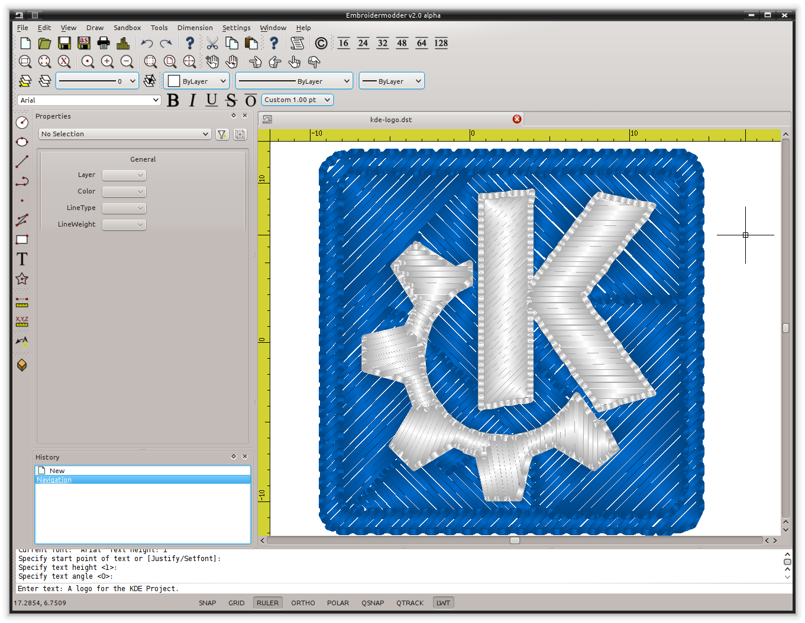

================================
Embroidermodder Reference Manual
================================
-----------
2.0.0-alpha
-----------

.. toctree::
   :maxdepth: 2
   :caption: Contents
   :name: maintoc

Introduction
============

The Embroidermodder Project and Team
------------------------------------

The *Embroidermodder 2* project is a collection of small software
utilities for manipulating, converting and creating embroidery files in all
major embroidery machine formats. The program *Embroidermodder 2* itself
is a larger graphical user interface (GUI) which is at the heart of the project.

The tools and associated documents are:

* The website https://www.libembroidery.org
* This reference manual covering the development of all these projects with
the current version available here:
https://www.libembroidery.org/embroidermodder_2.0_manual.pdf}
* The GUI *Embroidermodder 2* covered in Chapter~\ref{GUI}.
* The core library of low-level functions: `libembroidery`, covered in
Chapter~\ref{libembroidery}
* The CLI `embroider`, which is part of libembroidery
* Mobile embroidery format viewers and tools convered in Chapter~\ref{Mobile}.
* Specs for an open source hardware embroidery machine extension called the Portable Embroidery Tool (PET) which is also part of libembroidery. See Chapter~\ref{PET}.

The website, this manual and some scripts to construct the distribution are
maintained in \citep{embroidermodder_website}.

They all tools to make the standard
user experience of working with an embroidery machine better without expensive
software which is locked to specific manufacturers and formats. But ultimately
we hope that the core *Embroidermodder 2* is a practical, ever-present tool in
larger workshops, small cottage industry workshops and personal hobbyist's
bedrooms.

Embroidermodder 2 is licensed under the zlib license and we aim to keep all of our tools open
source and free of charge. If you would like to support the project check out our  Open
Collective (https://opencollective.com/embroidermodder) group.
If you would like to help,
please join us on GitHub. This document is written as developer training as well helping new
users (see the last sections) so this is the place to learn how to start changing the code.

The Embroidermodder Team is the collection of people who've submitted
patches, artwork and documentation to our three projects.
The team was established by Jonathan Greig and Josh Varga.
The full list is actively maintained below.

Core Development Team
~~~~~~~~~~~~~~~~~~~~~

Embroidermodder 2:

* Jonathan Greig (https://github.com/redteam316)
* Josh Varga (https://github.com/JoshVarga)
* Robin Swift (https://github.com/robin-swift)

Embroidermodder 1:

* Josh Varga (https://github.com/JoshVarga)
* Mark Pontius (http://sourceforge.net/u/mpontius/profile)

Credits for Embroidermodder 2, libembroidery and all other related code
-----------------------------------------------------------------------

If you have contributed and wish to be added to this list, alter the  README on Embroidermodder
github page (https://github.com/Embroidermodder/Embroidermodder) and we'll copy it to the
libembroidery source code since that is credited to ``The Embroidermodder Team``.

Embroidermodder 1
~~~~~~~~~~~~~~~~~

The Embroidermodder Team is also inspired by the original Embroidermodder that
was built by Mark Pontius and the same Josh Varga on SourceForge which
unfortunately appears to have died from linkrot. We may create a distribution
on here to be the official ``legacy`` Embroidermodder code but likely in a
seperate repository because it's GNU GPL v3 and this code is written to be
zlib (that is, permissive licensed) all the way down.

One reason why this is useful is that the rewrite by Jonathan Greig, John Varga
and Robin Swift for Embroidermodder 2 should have no regressions: no features
present in v1 should be missing in v2.

Features
~~~~~~~~

Embroidermodder 2 has many advanced features that enable you to create awesome designs quicker, tweak existing designs to perfection, and can be fully customized to fit your workflow.

A summary of these features:

* Cross Platform
* Realistic rendering
* Various grid types and auto-adjusting rulers
* Many measurement tools
* Add text to any design
* Supports many formats
* Batch Conversion
* Scripting API

Cross Platform
~~~~~~~~~~~~~~

If you use multiple operating systems, it's important to choose software that works on all of them.

Embroidermodder 2 runs on Windows, Linux and Mac OS X. Let's not forget the  Raspberry
Pi (https://www.raspberrypi.org).

.. image::
   images/features-platforms-1.png

Realistic Rendering
~~~~~~~~~~~~~~~~~~~

It is important to be able to visualize what a design will look like when stitched and our
pseudo ``3D`` realistic rendering helps achieve this
(see Figure~\ref{real-render}).

Real render examples.

.. image::
   images/features-realrender-1.png

.. image::
   images/features-realrender-2.png



Various grid types and auto-adjusting rulers
~~~~~~~~~~~~~~~~~~~~~~~~~~~~~~~~~~~~~~~~~~~~

Making use of the automatically adjusting ruler in conjunction with the grid will ensure your
design is properly sized and fits within your embroidery hoop area.

Use rectangular, circular or isometric grids to construct your masterpiece!

Multiple grids and rulers in action Figure ref fig grid-ruler.

Grid and ruler examples.

.. image::
   images/features-grid-ruler-1.png

Many measurement tools
~~~~~~~~~~~~~~~~~~~~~~

Taking measurements is a critical part of creating great designs. Whether you are designing
mission critical embroidered space suits for NASA or some other far out design for your next
meet-up, you will have precise measurement tools at your command to make it happen. You can
locate individual points or find distances between any 2 points anywhere in the design!

Take quick and accurate measurements:

.. image::
   images/features-measure-1.png

Add text to any design
~~~~~~~~~~~~~~~~~~~~~~

Need to make company apparel for all of your employees with individual names on them? No sweat.
Just simply add text to your existing design or create one from scratch, quickly and easily.
Didn't get it the right size or made a typo? No problem. Just select the text and update it
with the property editor.

Add text and adjust its properties quickly:

.. image::
   images/features-text-1.png

Supports many formats
~~~~~~~~~~~~~~~~~~~~~~

Embroidery machines all accept different formats. There are so many formats
available that it can sometimes be confusing whether a design will work with your machine.

Embroidermodder 2 supports a wide variety of embroidery formats as well as several vector
formats, such as SVG and DXF. This allows you to worry less about which designs you can use.

Batch Conversion
~~~~~~~~~~~~~~~~

Need to send a client several different formats? Just use libembroidery-convert, our command
line utility which supports batch file conversion.

There are a multitude of formats to choose from:

.. image::
   images/features-formats-1.png

Scripting API
~~~~~~~~~~~~~

If you've got programming skills and there is a feature that isn't currently available that you
absolutely cannot live without, you have the capability to create your own custom commands for
Embroidermodder 2. We provide an QtScript API which exposes various application functionality
so that it is possible to extend the application without requiring a new release. If you have
created a command that you think is worth including in the next release, just  contact
us (contact.html) and we will review it for functionality, bugs, and finally inclusion.

An Embroidermodder 2 command excerpt:

.. image::
   images/features-scripting-1.png

% scripting screenshot

Scraps
------

For
Embroidermodder 2.0.0-alpha4, libembroidery 1.0.0-alpha, PET 1.0.0-alpha
and EmbroideryMobile 1.0.0-alpha.

Since the document is shipped automatically try to update the revnumber each
time you edit using `revision.sh`.

Test these:

    sudo apt install latexml texlive-latex-base imagemagick info2man

    # For our command line tools:
    makeinfo embroider.texi -o embroider.info
    info2man embroider.info > embroider.1
    texi2pdf embroider.texi
    # Or groff macro package for example ms.
    # These may be housed in libembroidery since they're to be shipped as part of
    # the embroider tarball.

    # For online documentation:
    pandoc embroidermodder_refman.tex -f latex -t html -s -o emb_refman.html --bibliography embroidermodder.bib
    # Or latexml/latexmlpost

Command Language
~~~~~~~~~~~~~~~~

Printer Command Language (PCL), see \citet{packard1992pcl}.

HP-GL/2 Vector Graphics \index{HP-GL/2} described in \citet{packard1992pcl}.
Has commands like: \texttt{PU} Pen Up, \texttt{PR} Plot Relative,
\texttt{EP} edge polygon.

So commands read like this:

    PA40,10;

command argument seperator(``,``) argument terminator(``;``)

Constructing new commands from old ones in the command language is less
natural in the HP-GL/2 language, but a similar layer for us is
the tajima DST format \citep{4} for existing printers and CNC commands for
direct control... where'd we'd use G-Code \citep{7} and Linux CNC \citep{6}.

Could we `setpagedevice` to a printer in some cases and a similar CUPS service
for embroidery machines in others?

All systems are supported by ghostscript, when you account for homebrew \citet{9}:

    brew update
    brew upgrade
    brew install ghostscript
    brew cleanup

Vector graphic logos don't require the SVG Qt library.

Man Pages
~~~~~~~~~

We maintain a traditional manpage for \texttt{embroider} using
the basic macros.

Arduino
~~~~~~~

    apt-get install avr-libc gcc-avr uisp avrdude

Libembroidery
=============

(Under construction, please wait for v1.0 release.)

Libembroidery is a low-level library for reading, writing,
and altering digital embroidery files in C. It is part of the Embroidermodder Project
for open source machine embroidery.

Libembroidery is the underlying library that is used by Embroidermodder 2
and is developed by  The Embroidermodder Team \ref{the-embroidermodder-team}.
A full list of contributors to the project is maintained in
the Embroidermodder 2 github (https://github.com/Embroidermodder/embroidermodder)
in the file ``CREDITS.md``. It handles over 45 different embroidery specific formats as well
as several non-embroidery specific vector formats.

It also includes a CLI called ``embroider`` that allows for better automation of
changes to embroidery files and will be more up-to date than
the Embroidermodder 2 GUI.

Documentation
~~~~~~~~~~~~~

Libembroidery is documented as part of this reference manual. If you need
libembroidery for any non-trivial usage or want to contribute to the library we
advise you read the appropriate design sections of the manual first. Copies of
this manual will be shipped with the packaged version of libembroidery, but to
build it we use the Doxyfile in
https://github.com/Embroidermodder/embroidermodder} the Embroidermodder git
repository.

For more basic usage, `embroider` should have some in-built help
starting with:

    $ embroider --help

License
~~~~~~~

Libembroidery is distributed under the permissive zlib licence, see the LICENCE
file.

Demos
-----

We're currently trying out some fill techniques which will be demonstrated here
and in the script ``qa_test.sh``.


Converts to:

.. image::
    images/examples/crossstitch_logo.png

Build
~~~~~

libembroidery and EmbroiderModder 2 use CMake builds
so if you are building the project to use as a library we recommend
you run:

.. literalinclude:: build_libembroidery.sh
   :language: bash
   :encoding: latin-1
   :linenos:

This builds both the static and shared versions of the library as well
as the command line program `embroider`.

[packard1992pcl]_
[linuxcncsrc]_
[linuxcnc]_
[adobe1990postscript]_
[postscript1999postscript]_
[eduTechDST]_
[cups]_
[millOperatorsManual]_
[oberg1914machinery]_
[dxf_reference]_
[embroidermodder_source_code]_
[libembroidery_source_code]_
[acatina]_
[kde_tajima]_
[wotsit_archive]_
[wotsit_siterip]_
[fineemb_dst]_
[edutechwiki_dst]_

References
~~~~~~~~~~

.. [packard1992pcl] FIXME 
.. [linuxcncsrc] FIXME 
.. [linuxcnc] FIXME 
.. [adobe1990postscript] FIXME 
.. [postscript1999postscript] FIXME 
.. [eduTechDST] FIXME 
.. [cups] FIXME 
.. [millOperatorsManual] FIXME 
.. [oberg1914machinery] FIXME 
.. [dxf_reference] FIXME 
.. [embroidermodder_source_code] FIXME 
.. [libembroidery_source_code] FIXME 
.. [acatina] FIXME 
.. [kde_tajima] FIXME 
.. [wotsit_archive] FIXME 
.. [wotsit_siterip] FIXME 
.. [fineemb_dst] FIXME fineemb dst
.. [edutechwiki_dst] FIXME edutechwiki dst

## Graphical User Interface for PC}
\ref{GUI}

### Overview}

\emph{UNDER MAJOR RESTRUCTURING, PLEASE WAIT FOR VERSION 2}

https://www.libembroidery.org}

Embroidermodder is a free machine embroidery application.
The newest version, Embroidermodder 2 can:

\begin{itemize}
* edit and create embroidery designs
* estimate the amount of thread and machine time needed to stitch a design
* convert embroidery files to a variety of formats
* upscale or downscale designs
* run on Windows, Mac and Linux
\end{itemize}

\emph{Embroidermodder 2} is very much a work in progress since we're doing a ground
up rewrite to an interface in C using the GUI toolkit SDL2.
The reasoning for this is detailed in the issues tab.

For a more in-depth look at what we are developing read our
website (https://www.libembroidery.org}) which includes these docs as well
as the up-to date printer-friendly versions. These discuss recent changes,
plans and has user and developer guides for all the Embroidermodder projects.

To see what we're focussing on right now, see the Open Collective
News (https://opencollective.com/embroidermodder}).

// fixme
This current printer-friendly version
is here (https://www.libembroidery.org/EM2.0.0-alpha_refman_a4.pdf}).

### License}

The source code is under the terms of the zlib license: see `LICENSE.md`
in the source code directory.

Permission is granted to copy, distribute and/or modify this document
under the terms of the GNU Free Documentation License, Version 1.3
or any later version published by the Free Software Foundation;
with no Invariant Sections, no Front-Cover Texts, and no Back-Cover Texts.

A copy of the license is included in Section~\ref{GNU-free-documentation-license}.

### Build and Install}

Assuming you already have the SDL2 libraries you can proceed to using the fast build, which
assumes you want to build and test locally.

The fast build should be:

\begin{verbatim}
bash build.sh
\end{verbatim}

or, on Windows:

\begin{verbatim}
.\build.bat
\end{verbatim}

Then run using the `run.bat` or `run.sh` scripts in the build/ directory.

Otherwise, follow the instructions below.

If you plan to install the dev version to your system (we recommend you wait
for the official installers and beta release first) then use the CMake build
instead.

### Install on Desktop}

We recommend that if you want to install the development version you use the CMake build. Like
this:

    git submodule --init --update

    mkdir build
    cd build
    cmake ..
    cmake --build .
    sudo cmake --install .

These lines are written into the file:

    ./build_install.sh

On Windows use the next section.

History
-------

Embroidermodder 1 was started by Mark Pontius in 2004 while staying up all night
with his son in his first couple months. When Mark returned to his day job, he
lacked the time to continue the project. Mark made the decision to focus on his
family and work, and in 2005, Mark gave full control of the project to Josh
Varga so that Embroidermodder could continue its growth.

Embroidermodder 2 was conceived in mid 2011 when Jonathan Greig and Josh Varga
discussed the possibility of making a cross-platform version. It is currently in
active development and will run on GNU/Linux, Mac OS X, Microsoft Windows and
Raspberry Pi.

All Embroidermodder downloads (downloads.html) are hosted on SourceForge.

The source code for Embroidermodder 1
(http://sourceforge.net/p/embroidermodder/code/HEAD/tree/embroidermodder1})
has always been hosted on Sourceforge.

The source code for Embroidermodder 2
(https://github.com/Embroidermodder/Embroidermodder}) was moved to GitHub
on July 18, 2013.

The website for Embroidermodder
(https://github.com/Embroidermodder/www.libembroidery.org}) was moved to
GitHub on September 9, 2013.

# Contact us}

For general questions email:  embroidermodder at gmail.com (mailto:embroidermodder@gmail.com})

To request a new feature  open an issue on the main Embroidermodder GitHub repository (https://github.com/Embroidermodder/Embroidermodder/issues}). We'll move it to the correct repository.

# Downloads}

## Alpha Build}

This is a highly experimental build: we recommend users wait for the beta release when the basic features
are functional.

Visit our  GitHub Releases page (https://github.com/Embroidermodder/Embroidermodder/releases)
for the current build. Unfortunately, earlier builds went down with the Sourceforge page we hosted them on.

# GUI}

Embroidermodder 2 is very much a work in progress since we're doing a ground up rewrite to an
interface in Python using the GUI toolkit Tk. The reasoning for this is detailed in the issues
tab.

For a more in-depth look at what we are developing read the developer notes (link to dev notes
section). This discusses recent changes in a less formal way than a changelog (since this
software is in development) and covers what we are about to try.

## Documentation}

The documentation is in the form of the website (included in the `docs/` directory) and the
printed docs in this file.

### Development}

If you wish to develop with us you can chat via the contact email on the
website (https://www.libembroidery.org}) or in the issues tab on the
github page (https://github.com/Embroidermodder/Embroidermodder/issues}).
People have been polite and friendly in these conversations and I (Robin) have
really enjoyed them. If we do have any arguments please note we have a Code of
Conduct (``CODE_OF_CONDUCT.md``) so there is a consistent policy to enforce when
dealing with these arguments.

The first thing you should try is building from source using the build advice(link to build)
above. Then read some of the development notes (link to dev notes.md) to get the general
layout of the source code and what we are currently planning.

### Testing}

To find unfixed errors run the tests by launching from the command line with:

    $ embroidermodder --test

then dig through the output. It's currently not worth reporting the errors, since
there are so many but if you can fix anything reported here you can submit a PR.

Code Optimisations and Simplifications
--------------------------------------

Geometry
~~~~~~~~

The geometry is stored, processed and altered via libembroidery. See the Python specific part
of the documentation for libembroidery for this. What the code in Embroidermodder does is make
the GUI widgets to change and view this information graphically.

For example if we create a circle with radius 10mm and center at `(20mm, 30mm)` then fill it
with stitches the commands would be

    from libembroidery import Pattern, Circle, Vector, satin
    circle = Circle(Vector(20, 30), 10)
    pattern = Pattern()
    pattern.add_circle(circle, fill=satin)
    pattern.to_stitches()

but the user would do this through a series of GUI actions:

* Create new file
* Click add circle
* Use the Settings dialog to alter the radius and center
* Use the fill tool on circle
* Select satin from the drop down menu

So EM2 does the job of bridging that gap.

### Postscript Support}

In order to safely support user contributed/shared data that can define, for
example, double to double functions we need a consistent processor for these
descriptions.

Embroidermodder backends to the postscript interpreter included in libembroidery
to accomplish this.

For example the string: `5 2 t mul add` is equivalent to
the expression $2*t + 5$.

The benefit of not allowing this to simply be a Python expression is that it is safe against
malicious use, or accidental misuse. The program can identify whether the output is of the
appropriate form and give finitely many calculations before declaring the function to have run
too long (stopping equations that hang).

To see examples of this see the \texttt{assets/shapes/*.ps} files.

### SVG Icons}

To make the images easier to alter and restyle we could switch to svg icons.
There's some code in the git history to help with this.

### The Actions System}

In order to simplify the development of a GUI that is flexible and easy to
understand to new developers we have a custom action system that all user
actions will go via an \texttt{actuator} that takes a string argument. By using a
string argument the undo history is just an array of strings.

The C ``action_hash_data`` struct will contain: the icon used, the
labels for the menus and tooltips and the function pointer for that action.
There will be an accompanying argument for this function call, currently being
drafted as ``action_call``. So when the user makes a function call it should
contain information like the mouse position, whether special key is pressed etc.

Accessibility
~~~~~~~~~~~~~

Software can be more or less friendly to people with dyslexia, partial
sightedness, reduced mobility and those who don't speak English. Embroidermodder
2 has, in its design, the following features to help:

\begin{itemize}
* icons for everything to reduce the amount of reading required
* the system font is configurable: if you have a dyslexia-friendly font you
can load it
* the interface rescales to help with partial-sightedness
* the system language is configurable, unfortunately the docs will only be
in English but we can try to supply lots of images of the interface to make it
easier to understand as a second language
* buttons are remappable: XBox controllers are known for being good for
people with reduced mobility so remapping the buttons to whatever setup you have
should help
\end{itemize}

Note that most of these features will be released with version 2.1, which is planned for around
early 2023.

### Sample Files}

Various sample embroidery design files can be found in the `embroidermodder2/samples` folder.

### Shortcuts}

A shortcut can be made up of zero or more modifier keys and at least one non-modifier key
pressed at once.

To make this list quickly assessable, we can produce a list of hashes which are simply the
flags ORed together.

The shortcuts are stored in the csv file `shortcuts.csv` as a 5-column table
with the first 4 columns describing the key combination. This is loaded into
the shortcuts `TABLE`. Each tick the program checks the input state for this
combination by first translating the key names into indices for the key state,
then checking for whether all of them are set to true.

### Removed Elements}

So I've had a few pieces of web infrastructure fail me recently and I think
it's worth noting. An issue that affects us is an issue that can effect people
who use our software.

### Qt and dependencies}

Downloading and installing Qt has been a pain for some users (46Gb on possibly
slow connections).

I'm switching to FreeGLUT 3 (which is a whole other conversation) which means
we can ship it with the source code package meaning only a basic build
environment is necessary to build it.

### Social Platform}

Github is giving me a server offline (500) error and is still giving a bad ping.

So... all the issues and project boards etc. being on Github is all well and
good assuming that we have our own copies. But we don't if Github goes down or
some other major player takes over the space and we have to move (again, since
this started on SourceForge).

This file is a backup for that which is why I'm repeating myself between them.

### OpenGL}

OpenGL rendering within the application. This will allow for Realistic Visualization - Bump
Mapping/OpenGL/Gradients?

This should backend to a C renderer or something.

### Configuration Data Ideas}

Embroidermodder should boot from the command line regardless of whether it is or is not
installed (this helps with testing and running on machines without root). Therefore, it can
create an initiation file but it won't rely on its existence to boot:
`~/.embroidermodder/config.json`.

* Switch colors to be stored as 6 digit hexcodes with a `\#`.
* We've got close to a hand implemented ini read/write setup in `settings.py`.

Distribution
~~~~~~~~~~~~

:index:`distribution`

When we release the new pip wheel we should also package:

* ``.tar.gz`` and ``.zip`` source archive.
* Debian package
* RPM package

Only do this once per minor version number.

.. todo::
   Screenshot a working draft to demonstrate.

Perennial Jobs
~~~~~~~~~~~~~~

* Check for memory leaks
* Clear compiler warnings on `-Wall -ansi -pedantic` for C.
* Write new tests for new code.
* Get Embroidermodder onto the current version of libembroidery.
* PEP7 compliance.
* Better documentation with more photos/screencaps.

Full Test Suite
~~~~~~~~~~~~~~
:index:`testing`

(This needs a hook from Embroidermodder to embroider's full test suite.)

The flag ``--full-test-suite`` runs all the tests that have been written.
Since this results in a lot of output the details are both to stdout
and to a text file called ``test_matrix.txt``.

Patches that strictly improve the results in the ``test_matrix.txt`` over
the current version will likely be accepted and it'll be a good place
to go digging for contributions. (Note: strictly improve means that
the testing result for each test is as good a result, if not better.
Sacrificing one critera for another would require some design work
before we would consider it.)

Symbols
~~~~~~~

:index:`symbols`

Symbols use the SVG path syntax.

In theory, we could combine the icons and symbols systems, since they could be
rendered once and stored as icons in Qt. (Or as textures in FreeGLUT.)

Also we want to render the patterns themselves using SVG syntax, so it would
save on repeated work overall.

Features
--------

Bindings
~~~~~~~~

:index:`bindings`

Bindings for libembroidery are maintained for the languages we use internally
in the project, for other languages we consider that the responsibility of
other teams using the library.

So libembroidery is going to be supported on:

* ``C`` (by default)
* ``C++`` (also by default)
* ``Java`` (for the Android :index:`Android` application MobileViewer)
* ``Swift`` (for the iOS :index:`iOS` application iMobileViewer)

For ``C#`` :index:`C-sharp` we recommend directly calling the function directly
using the DllImport feature:

    /* Calling readCsv() via C# as a native function. */
    [DllImport("libembroidery.so", EntryPoint="readCsv")]

see this StackOverflow discussion for help:
https://stackoverflow.com/questions/11425202/is-it-possible-to-call-a-c-function-from-c-net

For Python you can do the same using ctypes:
https://www.geeksforgeeks.org/how-to-call-a-c-function-in-python/

Other Supported Thread Brands
~~~~~~~~~~~~~~~~~~~~~~~~~~~~~

:index:`supported threads`

The thread lists that aren't preprogrammed into formats but are indexed in
the data file for the purpose of conversion or fitting to images/graphics.

* Arc Polyester
* Arc Rayon
* Coats and Clark Rayon
* Exquisite Polyester
* Fufu Polyester
* Fufu Rayon
* Hemingworth Polyester
* Isacord Polyester
* Isafil Rayon
* Marathon Polyester
* Marathon Rayon
* Madeira Polyester
* Madeira Rayon
* Metro Polyester
* Pantone
* Robison Anton Polyester
* Robison Anton Rayon
* Sigma Polyester
* Sulky Rayon
* ThreadArt Rayon
* ThreadArt Polyester
* ThreaDelight Polyester
* Z102 Isacord Polyester

House Style
-----------

A basic set of guidelines to use when submitting code.

Naming Conventions
~~~~~~~~~~~~~~~~~~

Name variables and functions intelligently to minimize the need for comments.
It should be immediately obvious what information it represents.
Short names such as x and y are fine when referring to coordinates.
Short names such as i and j are fine when doing loops.

Variable names should be ``camelCase``, starting with a lowercase word followed by uppercase word(s).
C++ Class Names should be ``CamelCase``, using all uppercase word(s).
C Functions that attempt to simulate namespacing, should be "nameSpace_camelCase".

All files and directories shall be lowercase and contain no spaces.

Code Style
~~~~~~~~~~

Tabs should not be used when indenting. Setup your IDE or text editor to use 4 spaces.

If you use KATE (KDE Advanced Text Editor), modelines are included in our code to enforce 
some of our coding standards. When creating new C/C++ files, please add
the modeline to the bottom of the file followed by a blank line. Always make sure there
is an extra blank line at the end of a file.

When using braces, please put the brace on a new line, unless the code is specially formatted
for easier reading such as a block of one liner if/else statements.

Use exceptions sparingly.

if/else is preferred over switch/case.

Do not use ternary operator (?:) in place of if/else.

Do not repeat a variable name that already occurs in an outer scope.

Version Control 
~~~~~~~~~~~~~~~

Being an open source project, developers can grab the latest code at any time
and attempt to build it themselves. We try our best to ensure that it will build smoothly
at any time, although occasionally we do break the build. In these instances,
please provide a patch, pull request which fixes the issue or open an issue and
notify us of the problem, as we may not be aware of it and we can build fine.

Try to group commits based on what they are related to: features/bugs/comments/graphics/commands/etc...

Comments
~~~~~~~~

When writing code, sometimes there are items that we know can be improved,
incomplete or need special clarification. In these cases, use the types of
comments shown below. They are pretty standard and are highlighted by many editors to
make reviewing code easier. We also use shell scripts to parse the code to find
all of these occurances so someone wanting to go on a bug hunt will be able to
easily see which areas of the code need more love.

    C++ Style Comments
    TODO: This code clearly needs more work or further review.
    BUG: This code is definitely wrong. It needs fixed.
    HACK: This code shouldn't be written this way or I don't feel right about it. There may a better solution.
    WARNING: Think twice (or more times) before changing this code. I put this here for a good reason.
    NOTE: This comment is much more important than lesser comments.

libembroidery is written in C and adheres to C89 standards. This means
that any C99 or C++ comments will show up as errors when compiling with
gcc. In any C code, you must use:

    /* C Style Comments */
    /* TODO: This code clearly needs more work or further review. */
    /* BUG: This code is definitely wrong. It needs fixed. */
    /* HACK: This code shouldn't be written this way or I don't feel right about it. There may a better solution */
    /* WARNING: Think twice (or more times) before changing this code. I put this here for a good reason. */
    /* NOTE: This comment is much more important than lesser comments. */

These are rules for the general intended style of Embroidermodder's GUI source
code. Not included are anything that a compiler will warn you about: fixing
compiler warnings is more important than fixing style.

Most of this section is rationale, so skip to the end for the summary.

NEW DEVELOPERS: if your patch to Embroidermodder doesn't follow these rules,
don't worry about it. We only ask that your source code follow the basic rules
in the developer training section. These rules are for sculpting Embroidermodder
into a body of code that is resiliant to future bugs and reliable for users.

Brevity
~~~~~~~

Readable source code is short. Developers have finite time and becoming
acquainted with more than 1000 lines of dense C code is often too high a bar
for a new developer to a project. However, this leads to a bunch of tradeoffs
that have caused issues, so instead we consider the ``minimal library``
rather than ``minimal code`` approach. Not everyone will have used the more
abstract, syntactic features of C++ like templates and operator overloading.
Even if they are capable developers with these features it makes debugging far
harder since the choice of called function is interpreted by the compiler and compiler
errors are hundred line monsters per infraction of ``these are all of the possible
variations of this function that don't match``.

Using C++'s ``unordered_map`` can simplify source code in that anything can
map to anything. However, it also means we don't have to associate related structures.
For example the ``action_table`` came together replacing a collection of unordered maps
with one, then replaced the mapping with labelled indices. Since the ``actuator_core``
is a giant switch/case statement this cuts the step of identifying the action by its
label `std::string`.
The structure given by this table allowed the code to be much
easier to interpret. So for this reason we don't recommend the use unordered maps or hashes any more.

Rigidity Vs. Ease of Modification
~~~~~~~~~~~~~~~~~~~~~~~~~~~~~~~~~

Difficult to restructure code is good if the structure that's there is good.
It guides new developers into safe practices without having to explain them.
Therefore we want ease of modification that comes from well chosen `structs`
and a carefully curated global header of .

Developer Prose
~~~~~~~~~~~~~~~

Macro Policy
~~~~~~~~~~~~

Macros are great, you can do all sorts with them. But it's easy to make readable
short code that is really difficult to safely modify.

Function Style
~~~~~~~~~~~~~~

1. Don't write a new convenience function unless there are two
existing applications of it in the source code.
2. 

Summary
~~~~~~~

* .

GUI Design
----------

:index:`GUI`

Embroidermodder 2 was written in C++/Qt5 and it was far too complex. We had
issues with people not able to build from source because the Qt5 libraries were
so ungainly. So I decided to do a rewrite in C/SDL2 (originally FreeGLUT, but
that was a mistake) with data stored as YAML. This means linking 4-7 libraries
depending on your system which are all well supported and widely available.

This is going well, although it's slow progress as I'm trying to keep track of
the design while also doing a ground up rewrite. I don't want to throw away good
ideas. Since I also write code for libembroidery my time is divided.

Overview of the UI rewrite

(Problems to be solved in brackets.)

It's not much to look at because I'm trying to avoid using an external
widgets system, which in turn means writing things like toolbars and menubars
over. If you want to get the design the actuator is the heart of it.

Without Qt5 we need a way of assigning signals with actions, so this is what
I've got: the user interacts with a UI element, this sends an integer to the
actuator that does the thing using the current state of the mainwindow struct
of which we expect there to be exactly one instance. The action is taken out
by a jump table that calls the right function (most of which are missing in
action and not connected up properly). It also logs the number, along with
key parts of the main struct in the undo history (an unsolved problem because
we need to decide how much data to copy over per action). This means undo,
redo and repeat actions can refer to this data.

To Do
-----

These should be sorted into relevant code sections.

Current work
~~~~~~~~~~~~

* `EmbPattern *pattern` as a variable in the `View` class.
* Removing the now unnecessary `SaveObject` class.
* Converting all comments to C style.
* Switching away from Doxygen-style in favour of direct commentary and a custom written reference manual.

Documentation
~~~~~~~~~~~~~

* Document all tests.
* Automation of tests.
* Ensure that the stitch count matches what we know the file has


2.0 alpha1
~~~~~~~~~~

* WIP - Statistics from 1.0, needs histogram
* WIP - Saving DST/PES/JEF (varga)
* WIP - Saving CSV/SVG (rt) + CSV read/write UNKNOWN interpreted as COLOR bug

2.0 alpha2
~~~~~~~~~~

* Notify user of data loss if not saving to an object format.
* Import Raster Image
* SNAP/ORTHO/POLAR
* Layer Manager + LayerSwitcher DockWidget
* Reading DXF

2.0 alpha3
~~~~~~~~~~

* Writing DXF
* Amount of Thread and Machine Time Estimation (also allow customizable times for setup, color changes, manually trimming jump threads, etc. that way a realistic total time can be estimated)
* Otto Theme Icons - whatsthis icon doesn't scale well, needs redone
* embroidermodder2.ico 16 x 16 looks horrible

2.0 alpha4
~~~~~~~~~~

* WIP - CAD Command: Arc (rt)
* Load/Save Menu/Toolbars configurations into settings.ini

2.0 beta1
~~~~~~~~~

* Custom Filter Bug - doesn't save changes in some cases
* Cannot open file with \# in name when opening multiple files (works fine when opening the single file)
* Closing Settings Dialog with the X in the window saves settings rather than discards them
* WIP - Advanced Printing
* Filling Algorithms (varga)
* Otto Theme Icons - beta (rt) - Units, Render, Selectors

2.0 rc1
~~~~~~~

* Review KDE4 Thumbnailer
* Documentation for libembroidery and formats
* HTML Help files
* Update language translations
* CAD Command review: line
* CAD Command review: circle
* CAD Command review: rectangle
* CAD Command review: polygon
* CAD Command review: polyline
* CAD Command review: point
* CAD Command review: ellipse
* CAD Command review: arc
* CAD Command review: distance
* CAD Command review: locatepoint
* CAD Command review: move
* CAD Command review: rgb
* CAD Command review: rotate
* CAD Command review: scale
* CAD Command review: singlelinetext
* CAD Command review: star
* Clean up all compiler warning messages, right now theres plenty :P

2.0 release
~~~~~~~~~~~

* tar.gz archive
* zip archive
* Debian Package (rt)
* NSIS Installer (rt)
* Mac Bundle?
* press release

2.x/Ideas
~~~~~~~~~

* libembroidery.mk for MXE project (refer to qt submodule packages for qmake based building. Also refer to plibc.mk for example of how write an update macro for github.)
* libembroidery safeguard for all writers - check if the last stitch is an END stitch. If not, add an end stitch in the writer and modify the header data if necessary.
* Cut/Copy - Allow Post-selection
* CAD Command: Array
* CAD Command: Offset
* CAD Command: Extend
* CAD Command: Trim
* CAD Command: BreakAtPoint
* CAD Command: Break2Points
* CAD Command: Fillet
* CAD Command: Chamfer
* CAD Command: Split
* CAD Command: Area
* CAD Command: Time
* CAD Command: PickAdd
* CAD Command: Product
* CAD Command: Program
* CAD Command: ZoomFactor
* CAD Command: GripHot
* CAD Command: GripColor and GripCool
* CAD Command: GripSize
* CAD Command: Highlight
* CAD Command: Units
* CAD Command: Grid
* CAD Command: Find
* CAD Command: Divide
* CAD Command: ZoomWindow (Move out of view.cpp)
* Command: Web (Generates Spiderweb patterns)
* Command: Guilloche (Generates Guilloche patterns)
* Command: Celtic Knots
* Command: Knotted Wreath
* Lego Mindstorms NXT/EV3 ports and/or commands.
* native function that flashes the command prompt to get users attention when using the
prompt is required for a command.
* libembroidery-composer like app that combines multiple files into one.
* Settings Dialog, it would be nice to have it notify you when switching tabs that a
setting has been changed. Adding an Apply button is what would make sense for this to happen.
* Keyboard Zooming/Panning
* G-Code format?
* 3D Raised Embroidery
* Gradient Filling Algorithms
* Stitching Simulation
* RPM packages?
* Reports?
* Record and Playback Commands
* Settings option for reversing zoom scrolling direction
* Qt GUI for libembroidery-convert
* EPS format? Look at using Ghostscript as an optional add-on to libembroidery
* optional compile option for including LGPL/GPL libs etc. with warning to user about license requirements.
* Realistic Visualization - Bump Mapping/OpenGL/Gradients?
* Stippling Fill
* User Designed Custom Fill
* Honeycomb Fill
* Hilburt Curve Fill
* Sierpinski Triangle fill
* Circle Grid Fill
* Spiral Fill
* Offset Fill
* Brick Fill
* Trim jumps over a certain length.
* FAQ about setting high number of jumps for more controlled trimming.
* Minimum stitch length option. (Many machines also have this option too)
* Add 'Design Details' functionality to libembroidery-convert
* Add 'Batch convert many to one format' functionality to libembroidery-convert
* EmbroideryFLOSS - Color picker that displays catalog numbers and names.
* emscripten/javascript port of libembroidery
  
Arduino
~~~~~~~

* Fix emb-outline files
* Fix thread-color files
* Logging of Last Stitch Location to External USB Storage(commonly available and easily replaced), wait until TRE is available to avoid rework
* inotool.org - seems like the logical solution for Nightly/CI builds
* Smoothieboard experiments

libembroidery-tests
~~~~~~~~~~~~~~~~~~~

* looping test that reads 10 times while running valgrind. See ``embPattern_loadExternalColorFile()`` Arduino leak note for more info.

* todo sort todo list.
* Alpha: High priority
  * Statistics from 1.0, needs histogram
  * Saving DST/PES/JEF (varga)
  * Saving CSV/SVG (rt) + CSV read/write UNKNOWN interpreted as COLOR bug
* Alpha: medium priority
  * Notify user of data loss if not saving to an object format.
  * Import Raster Image
  * SNAP/ORTHO/POLAR
  * Layer Manager + LayerSwitcher DockWidget
  * Reading DXF
* Alpha: low priority
  * Writing DXF* Up and Down keys cycle thru commands in the command prompt
  * Amount of Thread, Machine Time Estimation (also allow customizable times
for setup, color changes, manually
trimming jump threads, etc...that way a realistic total time can be estimated)
  * Otto Theme Icons - whatsthis icon doesn't scale well, needs redone
  * embroidermodder2.ico 16 x 16 looks horrible
* Alpha: lower priority
  * CAD Command: Arc (rt)
* beta
  * Custom Filter Bug - doesn't save changes in some cases
  * Cannot open file with `\#` in name when opening multiple files (works fine
when opening the single file)
  * Closing Settings Dialog with the X in the window saves settings rather than
discards them
  * Advanced Printing
  * Filling Algorithms (varga)
  * Otto Theme Icons - beta (rt) - Units, Render, Selectors
* Finish before 2.0 release
  * QDoc Comments
  * Review KDE4 Thumbnailer
  * Documentation for libembroidery and formats
  * HTML Help files
  * Update language translations
  * CAD Command review: line
  * CAD Command review: circle
  * CAD Command review: rectangle
  * CAD Command review: polygon
  * CAD Command review: polyline
  * CAD Command review: point
  * CAD Command review: ellipse
  * CAD Command review: arc
  * CAD Command review: distance
  * CAD Command review: locatepoint
  * CAD Command review: move
  * CAD Command review: rgb
  * CAD Command review: rotate
  * CAD Command review: scale
  * CAD Command review: singlelinetext
  * CAD Command review: star
  * Clean up all compiler warning messages, right now theres plenty :P
* 2.0
  * tar.gz archive
  * zip archive
  * Debian Package (rt)
  * NSIS Installer (rt)
  * Mac Bundle?
  * press release
* 2.x/Ideas
  * libembroidery.mk for MXE project (refer to qt submodule packages for qmake based building. Also refer to plibc.mk for example of how write an update macro for github.)
  * libembroidery safeguard for all writers - check if the last stitch is an END stitch. If not, add an end stitch in the writer and modify the header data if necessary.
  * Cut/Copy - Allow Post-selection
  * CAD Command: Array
  * CAD Command: Offset
  * CAD Command: Extend
  * CAD Command: Trim
  * CAD Command: BreakAtPoint
  * CAD Command: Break2Points
  * CAD Command: Fillet
  * CAD Command: Chamfer
  * CAD Command: Split
  * CAD Command: Area
  * CAD Command: Time
  * CAD Command: PickAdd
  * CAD Command: Product
  * CAD Command: Program
  * CAD Command: ZoomFactor
  * CAD Command: GripHot
  * CAD Command: GripColor and GripCool
  * CAD Command: GripSize
  * CAD Command: Highlight
  * CAD Command: Units
  * CAD Command: Grid
  * CAD Command: Find
  * CAD Command: Divide
  * CAD Command: ZoomWindow (Move out of view.cpp)
  * Command: Web (Generates Spiderweb patterns)
  * Command: Guilloche (Generates Guilloche patterns)
  * Command: Celtic Knots
  * Command: Knotted Wreath
  * Lego Mindstorms NXT/EV3 ports and/or commands.
  * native function that flashes the command prompt to get users attention when using the prompt is required for a command.
  * libembroidery-composer like app that combines multiple files into one.
  * Settings Dialog, it would be nice to have it notify you when switching tabs that a setting has been changed. Adding an Apply button is what would make sense for this to happen.
  * Keyboard Zooming/Panning
  * G-Code format?
  * 3D Raised Embroidery
  * Gradient Filling Algorithms
  * Stitching Simulation
  * RPM packages?
  * Reports?
  * Record and Playback Commands
  * Settings option for reversing zoom scrolling direction
  * Qt GUI for libembroidery-convert
  * EPS format? Look at using Ghostscript as an optional add-on to libembroidery...
  * optional compile option for including LGPL/GPL libs etc... with warning to user about license requirements.
  * Realistic Visualization - Bump Mapping/OpenGL/Gradients?
  * Stippling Fill
  * User Designed Custom Fill
  * Honeycomb Fill
  * Hilbert Curve Fill
  * Sierpinski Triangle fill
  * Circle Grid Fill
  * Spiral Fill
  * Offset Fill
  * Brick Fill
  * Trim jumps over a certain length.
  * FAQ about setting high number of jumps for more controlled trimming.
  * Minimum stitch length option. (Many machines also have this option too)
  * Add 'Design Details' functionality to libembroidery-convert
  * Add 'Batch convert many to one format' functionality to libembroidery-convert
  * EmbroideryFLOSS - Color picker that displays catalog numbers and names.
* beta
  * Realistic Visualization - Bump Mapping/OpenGL/Gradients?
  * Get undo history widget back (BUG).
  * Mac Bundle, .tar.gz and .zip source archive.
  * NSIS installer for Windows, Debian package, RPM package
  * GUI frontend for embroider features that aren't
supported by embroidermodder: flag selector from a table
  * Update all formats without color to check for edr or rgb files.
  * Setting for reverse scrolling direction (for zoom, vertical pan)
  * Keyboard zooming, panning
  * New embroidermodder2.ico 16x16 logo that looks good at that scale.
  * Saving dst, pes, jef.
  * Settings dialog: notify when the user is switching tabs
that the setting has been changed, adding apply button is what would
make sense for this to happen.
  * Update language translations.
  * Replace KDE4 thumbnailer.
  * Import raster image.
  * Statistics from 1.0, needs histogram.
  * SNAP/ORTHO/POLAR.
  * Cut/copy allow post-selection.
  * Layout into config.
  * Notify user of data loss if not saving to an object format.
  * Add which formats to work with to preferences.
  * Cannot open file with `\#` in the name when opening multiple
    files but works with opening a single file.
  * Closing settings dialog with the X in the window saves
settings rather than discarding them.
  * Otto theme icons: units, render, selectors, what's
this icon doesn't scale.
  * Layer manager and Layer switcher dock widget.
  * Test that all formats read data in correct scale
(format details should match other programs).
  * Custom filter bug -- doesn't save changes in some cases.
  * Tools to find common problems in the source code and suggest fixes
to the developers. For example, a translation miss: that is, for any language
other than English a missing entry in the translation table should supply a
clear warning to developers.
  * Converting Qt C++ version to native GUI C throughout.
  * OpenGL Rendering: `Real` rendering to see what the embroidery
looks like, Icons and toolbars, Menu bar.
  * Libembroidery interfacing: get all classes to use the proper
libembroidery types within them. So `Ellipse` has `EmbEllipse` as public
data within it.
  * Move calculations of rotation and scaling into `EmbVector` calls.
  * GUI frontend for embroider features that aren't supported by
embroidermodder: flag selector from a table
  * Update all formats without color to check for edr or rgb files.
  * Setting for reverse scrolling direction (for zoom, vertical pan)
  * Keyboard zooming, panning
  * Better integrated help: I don't think the help should backend to
a html file somewhere on the user's system. A better system would be a custom
widget within the program that's searchable.
  * New embroidermodder2.ico 16x16 logo that looks good at that scale.
  * Settings dialog: notify when the user is switching tabs that the
setting has been changed, adding apply button is what would make sense for
this to happen.

Introduction
==================

The *Embroidermodder 2* project is a collection of small software utilities for
manipulating, converting and creating embroidery files in all major embroidery
machine formats. The program \textit{Embroidermodder 2} itself is a larger graphical
user interface (GUI) which is at the heart of the project.

This manual, the website (`embroidermodder.org`), mobile embroidery format viewers
and tools (`iMobileViewer`, `MobileViewer`), the core library of functions
(`libembroidery`) and CLI (`embroider`) are all tools to make the standard
user experience of working with an embroidery machine better without expensive
software which is locked to specific manufacturers and formats. But ultimately
we hope that the core \textit{Embroidermodder 2} is a practical, ever-present tool in
larger workshops, small cottage industry workshops and personal hobbyist's
bedrooms.

Embroidermodder 2 is licensed under the zlib license and we aim to keep all of
our tools open source and free of charge. If you would like to support the
project check out our Open Collective group. If you would like to help, please
join us on GitHub. This document is written as developer training as well
helping new users (see the last sections) so this is the place to learn how
to start changing the code.

The Graphical User Interface: Embroidermodder 2.0.0-alpha
=========================================================

Abstract
--------

Overview
--------

Features
--------

Embroidermodder 2 has many advanced features that enable you to create awesome designs quicker, tweak existing designs to perfection, and can be fully customized to fit your workflow.

A summary of these features:

* Cross Platform
* Realistic rendering
* Various grid types and auto-adjusting rulers
* Many measurement tools
* Add text to any design
* Supports many formats
* Batch Conversion
* Scripting API

Cross Platform
~~~~~~~~~~~~~~

If you use multiple operating systems, it's important to choose software that works on all of them.

Embroidermodder 2 runs on Windows, Linux and Mac OS X. Let's not forget the Raspberry Pi (http://www.raspberrypi.org).

.. image::
   images/features-platforms-1.png

Realistic Rendering
~~~~~~~~~~~~~~~~~~~

It is important to be able to visualize what a design will look like when stitched and our pseudo ``3D`` realistic rendering helps achieve this.

Realistic rendering sample #1:

.. image::
   images/features-realrender-1.png

Realistic rendering sample #2:

.. image::
   images/features-realrender-2.png

Realistic rendering sample #3:


Various grid types and auto-adjusting rulers

Making use of the automatically adjusting ruler in conjunction with the grid will ensure your design is properly sized and fits within your embroidery hoop area.

Use rectangular, circular or isometric grids to construct your masterpiece!

Multiple grids and rulers in action:

.. image::
   images/features-grid-ruler-1.png

Many measurement tools
~~~~~~~~~~~~~~~~~~~~~~

Taking measurements is a critical part of creating great designs. Whether you are designing mission critical embroidered space suits for NASA or some other far out design for your next meet-up, you will have precise measurement tools at your command to make it happen. You can locate individual points or find distances between any 2 points anywhere in the design!

Take quick and accurate measurements:

.. image::
   images/features-measure-1.png

Add text to any design
~~~~~~~~~~~~~~~~~~~~~~

Need to make company apparel for all of your employees with individual names on them? No sweat. Just simply add text to your existing design or create one from scratch, quickly and easily.
Didn't get it the right size or made a typo? No problem. Just select the text and update it with the property editor.

Add text and adjust its properties quickly:

.. image::
   images/features-text-1.png

Supports many formats
~~~~~~~~~~~~~~~~~~~~~

Embroidery machines all accept different formats. There are so many formats available that it can sometimes be confusing whether a design will work with your machine.

Embroidermodder 2 supports a wide variety of embroidery formats as well as several vector formats, such as SVG and DXF. This allows you to worry less about which designs you can use.

Batch Conversion
~~~~~~~~~~~~~~~~

Need to send a client several different formats? Just use libembroidery-convert, our command line utility which supports batch file conversion.

There are a multitude of formats to choose from:

.. image::
   images/features-formats-1.png

Scripting API
~~~~~~~~~~~~~

If you've got programming skills and there is a feature that isn't currently available that you absolutely cannot live without, you have the capability to create your own custom commands for Embroidermodder 2. We provide an QtScript API which exposes various application functionality so that it is possible to extend the application without requiring a new release. If you have created a command that you think is worth including in the next release, just <a href=``contact.html``>contact us</a> and we will review it for functionality, bugs, and finally inclusion.

An Embroidermodder 2 command excerpt:

.. image::
   images/features-scripting-1.png

Contributing
------------

Version Control
~~~~~~~~~~~~~~~

Being an open source project, developers can grab the latest code at any time
and attempt to build it themselves. We try our best to ensure that it will build smoothly
at any time, although occasionally we do break the build. In these instances,
please provide a patch, pull request which fixes the issue or open an issue and
notify us of the problem, as we may not be aware of it and we can build fine.

Try to group commits based on what they are related to: features/bugs/comments/graphics/commands/etc...

See the coding style [here](#coding-style)

Introduction
------------

Basic Features
~~~~~~~~~~~~~~

Move a single stitch in an existing pattern
~~~~~~~~~~~~~~~~~~~~~~~~~~~~~~~~~~~~~~~~~~~

1. In the `File' menu, click `Open...'. When the open dialog appears find
  and select your file by double clicking the name of the file. Alternatively,
  left click the file once then click the `Open` button.
2.
3. In the `File' menu

.. tip::
   For users who prefer

Convert one pattern to another format
~~~~~~~~~~~~~~~~~~~~~~~~~~~~~~~~~~~~~

1. In the `File` menu, click `Open...`.
2. The 
3. In the dropdown menu within the save dialog select the 

Advanced Features
-----------------

Other Projects
--------------


Planning
~~~~~~~~

To see what's planned open the [Projects](https://github.com/Embroidermodder/Embroidermodder/projects/1) tab which sorts all of the GitHub Issues into columns.

Format Support
~~~~~~~~~~~~~~

| FORMAT | READ | WRITE | NOTES |
|---|---|---|---|
| 10o    | YES   |       | read (need to fix external color loading) (maybe find out what ctrl\| code flags of 0x10, 0x08, 0x04, and 0x02 mean) |
| 100    |       |       | none (4 byte codes) 61 00 10 09 (type, type2, x, y ?) x | y (signed char) |
| art    |       |       | none |
| bro    | YES   |       | read (complete)(maybe figure out detail of header) |
| cnd    |       |       | none |
| col    |       |       | (color file no design) read(final) write(final) |
| csd    | YES   |       | read (complete) |
| dat    |       |       | read () |
| dem    |       |       | none (looks like just encrypted cnd) |
| dsb    | YES   |       | read (unknown how well) (stitch data looks same as 10o) |
| dst    | YES   |       | read (complete) / write(unknown) |
dsz    | YES   |       | read (unknown) |
dxf    |       |       | read (Port to C. needs refactored) |
edr    |       |       | read (C version is broken) / write (complete) |
emd    |       |       | read (unknown) |
exp    | YES   |       | read (unknown) / write(unknown) |
exy    | YES   |       | read (need to fix external color loading) |
fxy    | YES   |       | read (need to fix external color loading) |
gnc    |       |       | none |
gt     |       |       | read (need to fix external color loading) |
hus    | YES   |       | read (unknown) / write (C version is broken) |
inb    | YES   |       | read (buggy?) |
jef    | YES   |       | write (need to fix the offsets when it is moving to another spot) |
ksm    | YES   |       | read (unknown) / write (unknown) |
pcd    |       |       |  |
pcm    |       |       | |
pcq    |       |       | read (Port to C)|
pcs    | BUGGY |       | read (buggy / colors are not correct / after reading, writing any other format is messed up)|
pec    |       |       | read / write (without embedded images, sometimes overlooks some stitches leaving a gap)|
pel    |       |       | none|
pem    |       |       | none|
pes    | YES   |       | |
phb    |       |       | |
phc    |       |       | |
rgb    |       |       | |
sew    | YES   |       | |
shv    |       |       | read (C version is broken)|
sst    |       |       | none|
svg    |       | YES   | |
tap    | YES   |       | read (unknown)|
u01    |       |       | |
vip    | YES   |       | |
vp3    | YES   |       | |
xxx    | YES   |       | |
zsk    |       |       | read (complete)
\end{longtable

Support for Singer FHE, CHE (Compucon) formats?

Embroidermodder Project Coding Standards
~~~~~~~~~~~~~~~~~~~~~~~~~~~~~~~~~~~~~~~~

A basic set of guidelines to use when submitting code.

Naming Conventions
~~~~~~~~~~~~~~~~~~

Name variables and functions intelligently to minimize the need for comments.
It should be immediately obvious what information it represents.
Short names such as ``x`` and ``y`` are fine when referring to coordinates.
Short names such as ``i`` and ``j`` are fine when doing loops.

Variable names should be `camelCase`, starting with a lowercase word followed by uppercase word(s).
C Functions that attempt to simulate namespacing, should be `nameSpace_camelCase`.

All files and directories shall be lowercase and contain no spaces.

Code Style
~~~~~~~~~~

Tabs should not be used when indenting. Setup your IDE or text editor to use 4 spaces.

\subsubsection{Braces}

For functions: please put each brace on a new line.

    void function_definition(int argument)
    {
        /* code block */
    }

For control statements: please put the first brace on the same line.

    if (condition) {
        /* code block */    
    }

Use exceptions sparingly.

Do not use ternary operator `(?:)` in place of if/else.

Do not repeat a variable name that already occurs in an outer scope.

Version Control
~~~~~~~~~~~~~~~

Being an open source project, developers can grab the latest code at any time
and attempt to build it themselves. We try our best to ensure that it will build smoothly
at any time, although occasionally we do break the build. In these instances,
please provide a patch, pull request which fixes the issue or open an issue and
notify us of the problem, as we may not be aware of it and we can build fine.

Try to group commits based on what they are related to: features/bugs/comments/graphics/commands/etc...

Comments
~~~~~~~~

When writing code, sometimes there are items that we know can be improved,
incomplete or need special clarification. In these cases, use the types of
comments shown below. They are pretty standard and are highlighted by many editors to
make reviewing code easier. We also use shell scripts to parse the code to find
all of these occurrences so someone wanting to go on a bug hunt will be able to
easily see which areas of the code need more love. Use the same convention
as libembroidery.

libembroidery is written in C and adheres to C89 standards. This means
that any C99 or C++ comments will show up as errors when compiling with
gcc. In any C code, you must use:

    /* C Style Comments */

    /* TODO: This code clearly needs more work or further review. */

    /* BUG: This code is definitely wrong. It needs fixed. */

    /* HACK: This code shouldn't be written this way or I don't feel
      * right about it. There may a better solution */

    /* WARNING: Think twice (or more times) before changing this code.
     * I put this here for a good reason. */

    /* NOTE: This comment is much more important than lesser comments. */

Donations
~~~~~~~~~

Creating software that interfaces with hardware is costly. A summary of some of the costs involved:

1. Developer time for 2 core developers
2. Computer equipment and parts
3. Embroidery machinery
4. Various electronics for kitbashing Embroiderbot
5. Consumable materials (thread, fabric, stabilizer, etc...)

If you have found our software useful, please consider funding further development by donating to the project [on Open Collective](https://opencollective.com/embroidermodder).

Introduction
------------

_(UNDER MAJOR RESTRUCTURING, PLEASE WAIT FOR VERSION 2)_

Embroidermodder is a free machine embroidery application.
The newest version, Embroidermodder 2 can:

* edit and create embroidery designs
* estimate the amount of thread and machine time needed to stitch a design
* convert embroidery files to a variety of formats
* upscale or downscale designs
* run on Windows, Mac and Linux

For more information, see our website \cite{thewebsite}.

Embroidermodder 2 is very much a work in progress since we're doing a ground up rewrite to an interface in Python using the GUI toolkit Tk. The reasoning for this is detailed in the issues tab.

For a more in-depth look at what we are developing read the developer notes\footnote{link to dev notes section}. This discusses recent changes in a less formal way than a changelog (since this software is in development) and covers what we are about to try.

To see what we're focussing on at the moment check this table.

| *Date* | *Event* |
|---|---|
| April-June 2022 | Finish the conversion to C/SDL2 |
| July-August 2022 | Finish all the targets in the Design, or assign them to 2.1. |
| September 2022 | Bugfixing, Testing, QA. libembroidery 1.0 will be released, then updates will slow down and the Embroidermodder 2 development version will be fixed to the API of this version. |
| October 2022 | Embroidermodder 2 is officially released. |

Build and Install
~~~~~~~~~~~~~~~~~

\subsubsection{Desktop}

First you must install the dependencies which aren't compiled into the source:

* ``git``
* ``cmake``
* A C compiler (we recommend `gcc` or `clang`)

on Debian Linux/GNU use:

    $ sudo apt install git clang build-essential libsdl2-dev \
        libsdl2-images-dev libsdl2-ttf-dev

If you can't find a good fit for your system (on Windows use the section below),
try compiling the included submodules with:

    $ bash build_deps.sh

From here, on most sytems the command:

    $ bash build.sh

will build the software. Currently this is the 2.0-alpha, which will have a build code of
some kind.

Dependencies and Build
~~~~~~~~~~~~~~~~~~~~~~

Plans
~~~~~

Windows Specific Advice
~~~~~~~~~~~~~~~~~~~~~~~

This is one of many possible ways to build the software on Windows,
this section is to help people who've not got a build environment to start with.

1. Download and install MSYS2 (follow their instructions): https://www.msys2.org/
2. Boot ``Mintty`` from the Start menu.
3. Use the commands:

.. literalinclude:: build_em_on_windows.sh
   :language: bash
   :encoding: latin-1
   :linenos:

Mobile
~~~~~~

These are currently unsupported (see iMobileViewer and Mobileviewer for
iOS and Android respectively), but after the Desktop version is
released we'll work on them.

The Mobile version will share some of the UI and all of the backend,
so development of the Desktop version will help us make both.

\subsubsection{Documentation}

The documentation is in the form of the website (included in the `docs/`
directory) and the printed docs in this file.

Development
~~~~~~~~~~~

If you wish to develop with us you can chat via the contact email
on the website (https://www.libembroidery.org) or in the issues tab on the
github page (https://github.com/Embroidermodder/Embroidermodder/issues).
People have been polite and friendly in these conversations and I (Robin)
have really enjoyed them.
If we do have any arguments please note we have a
[Code of Conduct](CODE_OF_CONDUCT.md) so there is a consistent policy to
enforce when dealing with these arguments.

The first thing you should try is building from source using the [build advice](link to build)
above. Then read some of the [development notes](link to dev notes.md) to get the general
layout of the source code and what we are currently planning.

Testing
~~~~~~~

To find unfixed errors run the tests by launching from the command line with:

    $ embroidermodder --test

then dig through the output. It's currently not worth reporting the errors, since
there are so many but if you can fix anything reported here you can submit a PR.

Overall Structure
~~~~~~~~~~~~~~~~~

Code Optimisations and Simplifications
~~~~~~~~~~~~~~~~~~~~~~~~~~~~~~~~~~~~~~

Current
~~~~~~~

What Robin is currently doing.

Getting the code to pass PyLint, that involves getting all source files
under 1000 lines, renaming all variables to be in snake case.

Changing the seperation of code between EM and libembroidery.

Translating the Qt widget framework to Tk.

Geometry
~~~~~~~~

The geometry is stored, processed and altered via libembroidery. See the Python specific part of the documentation for libembroidery for this. What the code in Embroidermodder does is make the GUI widgets to change and view this information graphically.

For example if we create a circle with radius 10mm and center at (20mm, 30mm) then fill it with stitches the commands would be

    from libembroidery import Pattern, Circle, Vector, satin
    circle = Circle(Vector(20, 30), 10)
    pattern = Pattern()
    pattern.add_circle(circle, fill=satin)
    pattern.to_stitches()

but the user would do this through a series of GUI actions:

1. Create new file
2. Click add circle
3. Use the Settings dialog to alter the radius and center
4. Use the fill tool on circle
5. Select satin from the drop down menu

So EM2 does the job of bridging that gap.

Settings Dialog
---------------

There are many codeblocks for changing out the colors in one go, for example:

    self.mw.update_all_view_select_box_colors(    self.accept["display_selectbox_left_color"],
    self.accept["display_selectbox_left_fill"],
    self.accept["display_selectbox_right_color"],
    self.accept["display_selectbox_right_fill"],
    self.preview["display_selectbox_alpha"])

This could be replaced with a simpler call

    self.mw.update_all_view_select_box_colors(
    self.accept["display_selectbox_colors"],
    self.preview["display_selectbox_alpha"])

where we require that

    self.accept["display_selectbox_colors"] == {
    "left_color": "#color",
    "left_fill": "#color",
    "right_color": "#color",
    "right_fill": "#color"
    }

with `\#color` being some valid hex code.

Kivy
~~~~

Once the tkinter interface is up and running we can experiment
with different frontends to improve the look of the application.
For example, the MIT licensed KIVY would allow us to replace the 
mobile development in Swift and Java with all Python development:

https://kivy.org/#home

Data/Code Seperation
~~~~~~~~~~~~~~~~~~~~

All the "data" is in code files that are within the `config/`
submodule. So this way we don't have to deal with awkward data
packaging, it's just available as a single JSON style object
called `settings` available with this import line:

    from embroidermodder.config import settings

In order to pass PyLint style guides this will be split up and
formatted into Python code but no processing beyond inlining
the data into a single dict should be carried out here.

The Settings Dictionary
~~~~~~~~~~~~~~~~~~~~~~~

No more than 4 levels of indentation

Only strings, arrays, dicts and integers so matching the JSON standard. Ideally you should be able to copy/paste the data in and out and it would parse as JSON. Currently this fails because we have multi-line strings in Python syntax and inlining.

We may be able to extend the lisp support, which would deal with this. Or we can change multiline strings out for arrays of strings.

Lisp Expression Support
~~~~~~~~~~~~~~~~~~~~~~~

In order to safely support user contributed/shared data that can
define, for example, double to double functions we need a consistent
processor for these descriptions.

Embroidermodder uses a list processor (a subset of the language
Lisp which is short for LISt Processor) to accomplish this.

For example the string:

    (+ (* t 2) 5)

is equivalent to the expression:

    2*t + 5

The benefit of not allowing this to simply be a Python expression
is that it is safe against malicious use, or accidental misuse.
The program can identify whether the output is of the appropriate
form and give finitely many calculations before declaring the
function to have run too long (stopping equations that hang).

To see examples of this see ``parser.py`` and
``config/design_primatives.py``.

It's also worth noting that we don't use the simpler reverse Polish
notation (RPN) approach because:

* It's more compact to use Lisp because `a b c + +` for example needs a new `+` sign for each new term as opposed to `(+ a b c)`.
* It's easier to support expressions that are themselves function calls defined by the user (by adding support for `defun` or `lambda`.

SVG Icons
~~~~~~~~~

To make the images easier to alter and restyle we could
switch to svg icons. There's some code in the git history
to help with this.

The Actions System
~~~~~~~~~~~~~~~~~~

In order to simplify the development of a GUI that is flexible and
easy to understand to new developers we have a custom action system that all
user actions will go via an `actuator` that takes a string argument. By using a
string argument the undo history is just an array of strings.

The C ``action_hash_data`` struct will contain: the icon used, the labels for the
menus and tooltips and the function pointer for that action.
There will be an accompanying argument for this function call, currently being
drafted as ``action_call``. So when the user makes a function call it should
contain information like the mouse position, whether special key is pressed
etc.

Accessibility
~~~~~~~~~~~~~

Software can be more or less friendly to people with dylexia, partial sightedness,
reduced mobility and those who don't speak English.
Embroidermodder 2 has, in its design, the following features to help:

* icons for everything to reduce the amount of reading required
* the system font is configurable: if you have a dyslexia-friendly font you can load it
* the interface rescales to help with partial-sightedness
* the system language is configurable, unfortunately the docs will only be in English but we can try to supply lots of images of the interface to make it easier to understand as a second language
* buttons are remappable: XBox controllers are known for being good for people with reduced mobility so remapping the buttons to whatever setup you have should help

Note that most of these features will be released with version 2.1, which is planned for around early 2023.

\subsubsection{Current Work}
~~~~~~~~~~~~~~~~~~~~~~~~~~~~~~~~~~~~~~

* Converting C++ to Python throughout.
* OpenGL Rendering
  * ``Real`` rendering to see what the embroidery looks like.
  * Icons and toolbars.
  * Menu bar
* Libembroidery interfacing:
  * Get all classes to use the proper libembroidery types within them. So `Ellipse` has `EmbEllipse` as public data within it.
* Move calculations of rotation and scaling into `EmbVector` calls.
* Get undo history widget back (BUG).
* Switch website to a CMake build.
* GUI frontend for embroider features that aren't supported by embroidermodder: flag selector from a table
* Update all formats without color to check for edr or rgb files.
* EmbroideryFLOSS - Color picker that displays catalog numbers and names
* Setting for reverse scrolling direction (for zoom, vertical pan)
* Stitching simulation
* User designed custom fill
* Keyboard zooming, panning
* Advanced printing
* Libembroidery 1.0
* Better integrated help: I don't think the help should backend to a html file somewhere on the user's system. A better system would be a custom widget within the program that's searchable.
* New embroidermodder2.ico 16x16 logo that looks good at that scale.
* saving dst, pes, jef
* Settings dialog: notify when the user is switching tabs that the setting has been changed, adding apply button is what would make sense for this to happen.
* Update language translations
* Replace KDE4 thumbnailer.
* Import raster image
* Statistics from 1.0, needs histogram.
* SNAP/ORTHO/POLAR
* Cut/copy allow post-selection
* Layout into config
* Notify user of data loss if not saving to an object format.
* Add which formats to work with to preferences.
* Cannot open file with \# in the name when opening multiple files but works with opening a single file.
* Closing settings dialog with the X in the window saves settings rather than discarding them.
* Otto theme icons: units, render, selectors, what's this icon doesn't scale
* Layer manager and Layer switcher dock widget
* test that all formats read data in correct scale (format details should match other programs).
* Custom filter bug -- doesn't save changes in some cases.
* Get flake8, pylint and tests to pass.
* Sphinx documentation from docstrings or similar.

For more details read on into the Design section.

\subsubsection{Sample Files}
~~~~~~~~~~~~~~~~~~~~~~~~~~~~~~~~~~~~~~

Various sample embroidery design files can be found in the embroidermodder2/samples folder.

\subsubsection{Design}
~~~~~~~~~~~~~~~~~~~~~~~~~~~~~~~~~~~~~~

These are key bits of reasoning behind why the software is built the way it is.

\subsubsection{CAD command review}
~~~~~~~~~~~~~~~~~~~~~~~~~~~~~~~~~~~~~~

| *ID* | *name* | *arguments* | *description* |
|---|---|---|---|
| 0 | newfile | none | Create a new EmbPattern with a new tab in the GUI. |
| 1 | openfile | filename string | Open an EmbPattern with the supplied filename `fname`. |
| 2 | savefile | filename string | Save the current loaded EmbPattern to the supplied filname `fname`. |
| 3 | scale | selected objects, 1 float | Scale all selected objects by the number supplied, without selection scales the entire design |
| 4 | circle | mouse co-ords | Adds a circle to the design based on the supplied numbers, converts to stitches on save for stitch only formats. |
| 5 | offset | mouse co-ords | Shifts the selected objects by the amount given by the mouse co-ordinates. |
| 6 | extend | | |
| 7 | trim | | |
| 8 | ``break_at_point`` | | |
| 9 | ``break_2_points`` | | |
| 10 | fillet | | |
| 11 | star | | |
| 12 | singlelinetext | | |
| 13 | chamfer | | |
| 14 | split | | |
| 15 | area | | |
| 16 | time | | |
| 17 | pickadd | | |
| 16 | zoomfactor | | |
| 17 | product | | |
| 18 | program | | |
| 19 | zoomwindow | | |
| 20 | divide | | |
| 21 | find | | |
| 22 | record | | |
| 23 | playback | | |
| 24 | rotate | | |
| 25 | rgb | | |
| 26 | move | | |
| 27 | grid | | |
| 28 | griphot |  | |
| 29 | gripcolor | | |
| 30 | gripcool |  | |
| 31 | gripsize |  | |
| 32 | highlight |  | |
| 33 | units |  | |
| 34 | locatepoint |  | |
| 35 | distance |  | |
| 36 | arc |  | |
| 37 | ellipse |  | |
| 38 | array |  | |
| 39 | point |  | |
| 40 | polyline |  | |
| 41 | polygon |  | |
| 42 | rectangle |  | |
| 43 | line |  | |
| 44 | arc (rt) |  | |
| 45 | dolphin |  | |
| 46 | heart |  |

\subsubsection{Removed Elements}
~~~~~~~~~~~~~~~~~~~~~~~~~~~~~~~~~~~~~~

So I've had a few pieces of web infrastructure fail me recently and
I think it's worth noting. An issue that affects us is an issue that
can effect people who use our software.

\subsubsection{Qt and dependencies}
~~~~~~~~~~~~~~~~~~~~~~~~~~~~~~~~~~~~~~

Downloading and installing Qt has been a pain for some users
(46Gb on possibly slow connections).

I'm switching to FreeGLUT 3 (which is a whole other conversation) which means we
can ship it with the source code package meaning only a basic build
environment is necessary to build it.

\subsubsection{Social Platform}
~~~~~~~~~~~~~~~~~~~~~~~~~~~~~~~~~~~~~~

Github is giving me a server offline (500) error and is still giving a bad ping.

So... all the issues and project boards etc. being on Github is all well and good assuming that we have our own copies. But we don't if Github goes down or some other major player takes over the space and we have to move (again, since this started on SourceForge).

This file is a backup for that which is why I'm repeating myself between them.

\subsubsection{Pandoc Documentation}
~~~~~~~~~~~~~~~~~~~~~~~~~~~~~~~~~~~~~~

The documentation is, well better in that it's housed in the main repository,
but I'm not a fan of the ``write once build many`` approach as it means
trying to weigh up how 3 versions are going to render.

Can we treat the website being a duplicate of the docs a non-starter?
I'd be happier with tex/pdf only and (I know this is counter-intuitive) one
per project.

\subsubsection{OpenGL}
~~~~~~~~~~~~~~~~~~~~~~~~~~~~~~~~~~~~~~

OpenGL rendering within the application. This will allow for
Realistic Visualization - Bump Mapping/OpenGL/Gradients?

This should backend to a C renderer or something.

\subsubsection{Configuration Data Ideas}
~~~~~~~~~~~~~~~~~~~~~~~~~~~~~~~~~~~~~~

embroidermodder should boot from the command line
regardless of whether it is or is not installed (this helps with testing and
running on machines without root). Therefore, it can create an initiation file
but it won't rely on its existence to boot: `~/.embroidermodder/config.json`.

* Switch colors to be stored as 6 digit hexcodes with a \texttt{\#}.
* We've got close to a hand implemented ini read/write setup in `settings.py`.

\subsubsection{Distribution}
~~~~~~~~~~~~~~~~~~~~~~~~~~~~~~~~~~~~~~

When we release the new pip wheel we should also package:

* `.tar.gz` and `.zip` source archive.
* Debian package
* RPM package

Only do this once per minor version number.

\subsubsection{Scripting Overhaul}
~~~~~~~~~~~~~~~~~~~~~~~~~~~~~~~~~~~~~~

Originally Embroidermodder had a terminal widget, this is why we removed it.

> ROBIN: I think supporting scripting within Embroidermodder doesn't make sense.
> 
> All features that use scripting can be part of libembroidery instead.
> Users who are capable of using scripting won't need it, they can alter their embroidery files in CSV format, or import pyembroidery to get access.
> It makes maintaining the code a lot more complicated, especially if we move away from Qt.
> Users who don't want the scripting feature will likely be confused by it, since we say that's what libembroidery, embroider and pyembroidery are for.
> 
> How about a simpler ``call user shell`` feature? Similar to texmaker we just call system on a batch or shell script supplied by the user and it processes the file directly then the software reloads the file. Then we aren't parsing it directly.
> 
> I don't want to change this without Josh's support because it's a fairly major change.
>
> JOSH: I totally agree.
> 
> I like the idea of scripting just so people that know how to code could write their own designs without needing to fully build the app. Scripting would be a very advanced feature that most users would be confused by. Libembroidery would be a good fit for advanced features.
> 
> Now we are using Python (again, sort of) this would be a lot more natural,
> perhaps we could boot the software without blocking the shell so they can
> interact? TODO: Screenshot a working draft to demonstrate.

\subsubsection{Perennial Jobs}
~~~~~~~~~~~~~~~~~~~~~~~~~~~~~~~~~~~~~~

* Check for memory leaks
* Write new tests for new code.
* Get Embroidermodder onto the current version of libembroidery.
* PEP7 compliance.
* Better documentation with more photos/screencaps.

\subsubsection{Developing for Android}
~~~~~~~~~~~~~~~~~~~~~~~~~~~~~~~~~~~~~~

[https://developer.android.com/studio/projects/add-native-code](https://developer.android.com/studio/projects/add-native-code)

```bash
$ apt install google-android-ndk-installer cmake lldb gradle
```

\section{The Command Line Interface: `embroider`}
~~~~~~~~~~~~~~~~~~~~~~~~~~~~~~~~~~~~~~

\subsection{Usage}
~~~~~~~~~~~~~~~~~~~~~~~~~~~~~~~~~~~~~~

For basic use, we recommend you build as above, then run without arguments:

```
$ embroider
```

which will print out this advice on how to use these tools without digging straight into the rest of this manual.

```
EMBROIDER
    A command line program for machine embroidery.
    Copyright 2013-2021 The Embroidermodder Team
    Licensed under the terms of the zlib license.

    https://github.com/Embroidermodder/libembroidery
    https://embroidermodder.org

Usage: embroider [OPTIONS] fileToRead...

Conversion:
-t, -to         Convert all files given to the format specified
                by the arguments to the flag, for example:
                    $ embroider -t dst input.pes
                would convert \``input.pes\`` to \``input.dst\``
                in the same directory the program runs in.

                The accepted input formats are (TO BE DETERMINED).
                The accepted output formats are (TO BE DETERMINED).

Output:
-h, -help       Print this message.
-f, -format     Print help on the formats that
                embroider can deal with.
-q, -quiet      Only print fatal errors.
-V, -verbose    Print everything that has reporting.
-v, -version    Print the version.

Graphics:
-c, -circle     Add a circle defined by the arguments
                given to the current pattern.
-e, -ellipse    Add a circle defined by the arguments
                given to the current pattern.
-l, -line       Add a line defined by the arguments
                given to the current pattern.
-P, -polyline   Add a polyline.
-p, -polygon    Add a polygon.
-s, -satin      Fill the current geometry with satin
                stitches according
                to the defined algorithm.
-S, -stitch     Add a stitch defined by the arguments
                given to the current pattern.

Quality Assurance:
    -test       Run the test suite.
```

For each of the flags described here we will go into greater detail in this manual.

\subsubsection{To Flag}

\subsubsection{Circle Flag}

\subsubsection{Ellipse Flag}

\subsubsection{Line Flag}

\subsubsection{Polyline Flag}

\subsubsection{Polygon Flag}

\subsubsection{Satin Flag}

\subsubsection{Stitch Flag}

\subsubsection{Basic Test Suite}

The flag `--test` runs the tests that take the least time and have the most utility. If you're submitting a patch for review, please run:

```bash
$ embroider --test | tail -n 1
```

You'll be presented with an overall PASS or FAIL for your build,
if your build fails you can try and trace the error with:

```bash
$ valgrind embroider --verbose --test
```

or

```bash
$ gdb --args embroider --verbose --test
```

depending on your preferred debugging approach. Passing this test
will be required for us to accept your patch.

\subsubsection{Full Test Suite}

The flag `--full-test-suite` runs all the tests that have been written.
Since this results in a lot of output the details are both to stdout
and to a text file called `test_matrix.txt`.

Patches that strictly improve the results in the `test_matrix.txt` over
the current version will likely be accepted and it'll be a good place
to go digging for contributions. (Note: strictly improve means that
the testing result for each test is as good a result, if not better.
Sacrificing one critera for another would require some design work
before we would consider it.)

### Ideas

\subsubsection{Rendering system}

There are two forms of render that will be produced.

1. A raster format as ppm so we can have a pixel for pixel output (for example extracting the embedded images in some formats).
2. The SVG format that will be fairly similar to InkStitch's format.

We have an EmbImage struct to store the raster format.

```bash
$ embroider test01.csv --render
```

currently creates a blank image. Previously the Hilbert curve test managed to
create a correctly rendered version.


#### Tactile art and braille support}

One application I'd like to leave a reminder here for is automating embroidery
for blind and partially sighted people.

There are many limitations to making braille (cost, poor support, lack of
widespread adoption in the sighted world) and as such there is a strong DIY
culture around it.

There are blind internet users who can also run terminal applications using a
refreshable braille display, so in theory we could support an application like
this for them:

```bash
$ embroider --braille ``Hello, world!`` hello.dst
```

which would produce braille that would read `Hello, world!` as an embroidery design.

Another option is tactile fills that use the same fill algorithms but are
designed better to facilitate tactile art.

I think the way forward on this is to call up the RNIB business advice line and ask for assistance once we have a working model. That way they can get us in contact with experts to review how legible the output is and usable the software is for the intended audience.

This is less important than getting better machine support but given the high social impact I think it should be a priority.

\subsubsection{The Low Level API: Libembroidery 1.0.0-alpha}


\subsubsection{API Reference}

\subsubsection{`convert`}


\subsubsection{Mobile Support: MobileViewer and iMobileViewer}

\subsubsection{Embroidermodder 2.0.0-alpha User Manual}

\subsubsection{Introduction}

\subsubsection{Basic Features}

\subsubsection{Move a single stitch in an existing pattern}

1. In the `File` menu, click `Open...`. When the open dialog appears find and select your file by double clicking the name of the file. Alternatively, left click the file once then click the `Open` button.
2. 
3. In the `File` menu

TIP: For users who prefer

\subsubsection{Convert one pattern to another}

1. In the `File` menu, click `Open...`.
2.  The
3.  In the dropdown menu within the save dialog select the

\subsubsection{Advanced Features}

\subsubsection{Other Projects}

\subsubsection{References}

\subsubsection{Ideas}

\subsubsection{Why this document}

I've been trying to make this document indirectly through the Github
issues page and the website we're building but I think a
straightforward, plain-text file needs to be the ultimate backup for
this. Then I can have a printout while I'm working on the project.

\subsubsection{Issues}

\subsubsection{Fix before Version 2}

So I've had a few pieces of web infrastructure fail me recently and I
think it's worth noting. An issue that affects us is an issue that can
effect people who use our software.

1. Googletests require a web connection to update and they update on each compilation.
2. Downloading and installing Qt has been a pain for some users (46Gb on possibly slow connections). I think it was davieboy64?
3. The documentation is, well better in that it's housed in the main repository, but I'm not a fan of the ``write once build many`` approach as it means trying to weigh up how 3 versions are going to render.
4. Github is giving me a server offline (500) error and is still giving a bad ping.
5. OpenGL rendering within the application. This will allow for Realistic Visualization - Bump Mapping/OpenGL/Gradients?
6. JSON configuration (Started, see `head\ -n\ 50\ src/mainwindow.cpp`.) Ok this is changing slightly. embroidermodder should boot from the command line regardless of whether it is or is not installed (this helps with testing and running on machines without root). Therefore, it can create an initiation file but it won't rely on its existence to boot: this is what we currently do with settings.ini.
7.  Get undo history widget back (BUG).
8.  Switch website to a CMake build.
9.  Mac Bundle, .tar.gz and .zip source archive.
10.  NSIS installer for Windows, Debian package, RPM package
11.  GUI frontend for embroider features that aren't supported by embroidermodder: flag selector from a table
12.  Update all formats without color to check for edr or rgb files.
13.  EmbroideryFLOSS - Color picker that displays catalog numbers and names
14.  Setting for reverse scrolling direction (for zoom, vertical pan)
15. Stitching simulation
16.  User designed custom fill
17.  Keyboard zooming, panning
18.  Advanced printing
19.  Libembroidery 1.0
20. Better integrated help: I don't think the help should backend to a html file somewhere on the user's system. A better system would be a custom widget within the program that's searchable.
21. New embroidermodder2.ico 16x16 logo that looks good at that scale.
22. saving dst, pes, jef
23. Settings dialog: notify when the user is switching tabs that the setting has been changed, adding apply button is what would make sense for this to happen.
24.  Update language translations
25.  Replace KDE4 thumbnailer.
26.  Import raster image
27.  Statistics from 1.0, needs histogram.
28.  SNAP/ORTHO/POLAR
29.  Cut/copy allow post-selection
30.  Layout into config
31.  Notify user of data loss if not saving to an object format.
32.  Add which formats to work with to preferences.
33.  Cannot open file with \# in the name when opening multiple files but works with opening a single file.
34.  Closing settings dialog with the X in the window saves settings rather than discarding them.
35. Otto theme icons: units, render, selectors, what's this icon doesn't  scale
36. Layer manager and Layer switcher dock widget
37. Test that all formats read data in correct scale (format details should match other programs).
38.  Custom filter bug -- doesn't save changes in some cases.

\subsubsection{Fix for Version 2.1}

\subsubsection{Fix eventually}

\subsubsection{googletests}

gtests are non-essential, testing is for developers not users so we can
choose our own framework. I think the in-built testing for libembroidery
was good and I want to re-instate it.

\subsubsection{Qt and dependencies}

I'm switching to SDL2 (which is a whole other conversation) which means
we can ship it with the source code package meaning only a basic build
environment is necessary to build it.

\subsubsection{Documentation}

Can we treat the website being a duplicate of the docs a non-starter?
I'd be happier with tex/pdf only and (I know this is counter-intuitive)
one per project.

\subsubsection{Social Platform}

So... all the issues and project boards etc. being on Github is all well and good assuming that we have our own copies. But we don't if Github goes down or some other major player takes over the space and we have to move (again, since this started on SourceForge).

This file is a backup for that which is why I'm repeating myself between them.

### JSON data Ideas

So:

1. Port `settings.ini` to `settings.json`.
2.  Place `settings.json` in `$HOME/.embroidermodder` (or equivalent, see the homedir function in \texttt{gui.c}).
3.  Parse JSON using cJSON (we have the new parseJSON function).
4.  Better structure for settings data so parse and load JSON is easier and there's less junk in global variables. A structure similar to a
5.  Python dict that uses constants like the sketch below.

\subsubsection{Why JSON over ini?}

1. We need to hand-write _a_ system because the current system is Qt dependent anyway.
2.  This way we can store more complex data structures in the same system including the layout of the widgets which may be user configured (see Blender and GIMP).
3.  Also it's easier to share information formatted this way between systems because most systems us JSON or XML data: there's better support for converting complex data this way.

\subsubsection{Sketch of a settings system}

```c
#define SETTING_interface_scale    16

...

char int_settings_labels[] = {
...
"interface scale" /* the sixteenth entry */
...
"%" /* terminator character */
};

...

    /* to use the setting */
    scale_interface(int_setting[SETTING_interface_scale]);

    /* to set setting */
    int_setting[SETTING_interface_scale] = 16;

    /* to make the JSON storage */
    for (i=0; int_settings_labels[i][0] != '%'; i++) {
        fprintf(setting_file, "\"%s\" :%d,\n", int_settings_labels[i], int_settings[i]);
```

This would all be in C, and wouldn't rely on Qt at all. We already use a
system like this in `libembroidery` so hopefully devs on both
would get the pattern.

\subsubsection{Design}

These are key bits of reasoning behind why the software is built the way
it is.

\subsubsection{Scripting Overhaul}

Originally Embroidermodder had a terminal widget, this is why we removed
it.

> ROBIN: I think supporting scripting within Embroidermodder doesn't make
> sense.
>
> All features that use scripting can be part of libembroidery instead.
> Users who are capable of using scripting won't need it, they can alter
> their embroidery files in CSV format, or import pyembroidery to get
> access. It makes maintaining the code a lot more complicated, especially
> if we move away from Qt. Users who don't want the scripting > feature will
> likely be confused by it, since we say that's what  libembroidery,
> embroider and pyembroidery are for.
>
> How about a simpler ``call user shell`` feature? Similar to texmaker we
> just call system on a batch or shell script supplied by the user and it
> processes the file directly then the software reloads the file. Then we
> aren't parsing it directly.
>
> I don't want to change this without Josh's support because it's a fairly
> major change.
>
>> JOSH: I totally agree.
>>
>> I like the idea of scripting just so people that know how to code could
>> write their own designs without needing to fully build the app.
>> Scripting would be a very advanced feature that most users would be
>> confused by. Libembroidery would be a good fit for advanced features.

\subsubsection{Perennial Jobs}

1. Check for memory leaks
2. Clear compiler warnings on `-Wall\ -ansi\ -pedantic` for C.

\subsubsection{Developing for Android}

https://developer.android.com/studio/projects/add-native-code

```
apt install google-android-ndk-installer cmake lldb gradle
```

\subsubsection{Bibilography}

\subsubsection{Introduction}

\subsubsection{Basic Features}

\subsubsection{Move a single stitch in an existing pattern}

1. In the `File` menu, click `Open...`. When the open dialog appears find and select your file by double clicking the name of the file. Alternatively, left click the file once then click the `Open` button.
2. .
3. In the `File` menu

TIP: For users who prefer

\subsubsection{Convert one pattern to another format}

* In the `File` menu, click `Open...`.
* The
* In the dropdown menu within the save dialog select the

\subsubsection{Advanced Features}

\subsubsection{Other Projects}

\subsubsection{References}

\subsubsection{Planning}

To see what's planned open the
[Projects](https://github.com/Embroidermodder/Embroidermodder/projects/1)
tab which sorts all of the GitHub Issues into columns.

\subsubsection{Format Support}

Support for Singer FHE, CHE (Compucon) formats?

\subsubsection{Embroidermodder Project Coding Standards}

A basic set of guidelines to use when submitting code.

\subsubsection{Naming Conventions}

Name variables and functions intelligently to minimize the need for
comments. It should be immediately obvious what information it
represents. Short names such as x and y are fine when referring to
coordinates. Short names such as i and j are fine when doing loops.

Variable names should be "camelCase", starting with a lowercase word
followed by uppercase word(s). C++ Class Names should be "CamelCase",
using all uppercase word(s). C Functions that attempt to simulate namespacing, should be ``nameSpace_camelCase``.

All files and directories shall be lowercase and contain no spaces.

\subsubsection{Code Style}

Tabs should not be used when indenting. Setup your IDE or text editor to
use 4 spaces.

\subsubsection{Braces}

For functions: please put each brace on a new line.

```
void function_definition(int argument)
{

}
```

For control statements: please put the first brace on the same line.

```
if (condition) {

}
```

Use exceptions sparingly.

Do not use ternary operator (?:) in place of if/else.

Do not repeat a variable name that already occurs in an outer scope.

### Version Control

Being an open source project, developers can grab the latest code at any
time and attempt to build it themselves. We try our best to ensure that
it will build smoothly at any time, although occasionally we do break
the build. In these instances, please provide a patch, pull request
which fixes the issue or open an issue and notify us of the problem, as
we may not be aware of it and we can build fine.

Try to group commits based on what they are related to:
features/bugs/comments/graphics/commands/etc...

### Comments

When writing code, sometimes there are items that we know can be
improved, incomplete or need special clarification. In these cases, use
the types of comments shown below. They are pretty standard and are
highlighted by many editors to make reviewing code easier. We also use
shell scripts to parse the code to find all of these occurrences so
someone wanting to go on a bug hunt will be able to easily see which
areas of the code need more love.

libembroidery is written in C and adheres to C89 standards. This means
that any C99 or C++ comments will show up as errors when compiling with
gcc. In any C code, you must use:

```
/* C Style Comments */
/* TODO: This code clearly needs more work or further review. */
/* BUG: This code is definitely wrong. It needs fixed. */
/* HACK: This code shouldn't be written this way or I don't feel right about it. There may a better solution */
/* WARNING: Think twice (or more times) before changing this code. I put this here for a good reason. */
/* NOTE: This comment is much more important than lesser comments. */
```

## Ideas

### Why this document

I've been trying to make this document indirectly through the Github
issues page and the website we're building but I think a
straightforward, plain-text file needs to be the ultimate backup for
this. Then I can have a printout while I'm working on the project.

### Issues

#### Fix before Version 2

So I've had a few pieces of web infrastructure fail me recently and I
think it's worth noting. An issue that affects us is an issue that can
effect people who use our software.

* Googletests require a web connection to update and they update on each compilation.
* Downloading and installing Qt has been a pain for some users (46Gb on possibly slow connections). I think it was davieboy64?
* Github is giving me a server offline (500) error and is still giving a bad ping.
* OpenGL rendering within the application. This will allow for Realistic Visualization - Bump Mapping/OpenGL/Gradients?
* JSON configuration (Started, see \texttt{head\ -n\ 50\ src/mainwindow.cpp.}) Ok this is changing slightly. embroidermodder should boot from the command line regardless of whether it is or is not installed (this helps with testing and running on machines without root). Therefore, it can create an initiation file but it won't rely on its existence to boot: this is what we currently do with settings.ini.
* Get undo history widget back (BUG).
* Switch website to a CMake build.
* Mac Bundle, .tar.gz and .zip source archive.
* NSIS installer for Windows, Debian package, RPM package
* GUI frontend for embroider features that aren't supported by  embroidermodder: flag selector from a table
* Update all formats without color to check for edr or rgb files.
* EmbroideryFLOSS - Color picker that displays catalog numbers and names
* Setting for reverse scrolling direction (for zoom, vertical pan)
* Stitching simulation
* User designed custom fill
* Keyboard zooming, panning
* Advanced printing
* Libembroidery 1.0
* Better integrated help: I don't think the help should backend to a html file somewhere on the user's system. A better system would be a custom widget within the program that's searchable.
* New embroidermodder2.ico 16x16 logo that looks good at that scale.
* saving dst, pes, jef
* Settings dialog: notify when the user is switching tabs that the setting has been changed, adding apply button is what would make sense for this to happen.
* Update language translations
* Replace KDE4 thumbnailer.
* Import raster image
* Statistics from 1.0, needs histogram.
* SNAP/ORTHO/POLAR
* Cut/copy allow post-selection
* Layout into config
* Notify user of data loss if not saving to an object format.
* Add which formats to work with to preferences.
* Cannot open file with \# in the name when opening multiple files but  works with opening a single file.
* Closing settings dialog with the X in the window saves settings rather than discarding them.
* Otto theme icons: units, render, selectors, what's this icon doesn't scale
* Layer manager and Layer switcher dock widget
*  test that all formats read data in correct scale (format details should match other programs).
* Custom filter bug -- doesn't save changes in some cases.

#### Fix for Version 2.1

#### Fix eventually

#### googletests

gtests are non-essential, testing is for developers not users so we can
choose our own framework. I think the in-built testing for libembroidery
was good and I want to re-instate it.

#### Qt and dependencies

I'm switching to SDL2 (which is a whole other conversation) which means
we can ship it with the source code package meaning only a basic build
environment is necessary to build it.

#### Documentation

Can we treat the website being a duplicate of the docs a non-starter?
I'd be happier with tex/pdf only and (I know this is counter-intuitive)
one per project.

#### Social Platform

So... all the issues and project boards etc. being on Github is all
well and good assuming that we have our own copies. But we don't if
Github goes down or some other major player takes over the space and we
have to move (again, since this started on SourceForge).

This file is a backup for that which is why I'm repeating myself between
them.

### JSON data Ideas

So:

1. Port `settings.ini` to `settings.json`.
2. Place `settings.json` in `$HOME/.embroidermodder` (or equivalent, see the homedir function in `gui.c`).
3. Parse JSON using cJSON (we have the new parseJSON function).
4. Better structure for settings data so parse and load JSON is easier and there's less junk in global variables. A structure similar to a Python dict that uses constants like the sketch below.

#### Why JSON over ini?

1. We need to hand-write _a_ system because the current system is Qt dependent anyway.
2. This way we can store more complex data structures in the same system including the layout of the widgets which may be user configured (see Blender and GIMP).
3. Also it's easier to share information formatted this way between systems because most systems us JSON or XML data: there's better support for converting complex data this way.

#### Sketch of a settings system

```
#define SETTING_interface_scale    16

...

char int_settings_labels[] = {
...
"interface scale" /* the sixteenth entry */
...
"%" /* terminator character */
};

...

    /* to use the setting */
    scale_interface(int_setting[SETTING_interface_scale]);

    /* to set setting */
    int_setting[SETTING_interface_scale] = 16;

    /* to make the JSON storage */
    for (i=0; int_settings_labels[i][0] != '%'; i++) {
        fprintf(setting_file, "\"%s\" :%d,\n", int_settings_labels[i], int_settings[i]);
    }
```

This would all be in C, and wouldn't rely on Qt at all. We already use a
system like this in \texttt{libembroidery} so hopefully devs on both
would get the pattern.

### Design

These are key bits of reasoning behind why the software is built the way
it is.

Conclusions
===========


Bibliography
============

The Embroidermodder Team _Embroidermodder_
 http://embroidermodder.org
 (accessed 3. June. 2022)

achatina *Technical Info*
 http://www.achatina.de/sewing/main/TECHNICL.HTM
 (accessed 28. Sep. 2021)

KDE Community
 _Projects/Liberty/File Formats/Tajima Ternary - KDE Community Wiki_
 https://community.kde.org/Projects/Liberty/File_Formats/Tajima_Ternary
 (accessed 28. Sep. 2021)


FineEmb Studio
 _FineEmb Studio \guillemotright DST_
 https://www.fineemb.com/blog/archives/dst-file-encoding.html
 (accessed 28. Sep. 2021)

EduTech Wiki
 _Embroidery format DST - EduTech Wiki_
 https://edutechwiki.unige.ch/en/Embroidery_format_DST}
 (accessed 28. Sep. 2021)

Color Charts
============

Built-ins
---------

SVG Colors
~~~~~~~~~~

Threads
-------

DXF color table
~~~~~~~~~~~~~~~

HUS color table
~~~~~~~~~~~~~~~

JEF color table
~~~~~~~~~~~~~~~

PCM color table
~~~~~~~~~~~~~~~

PEC color table
~~~~~~~~~~~~~~~

Contributing
------------

Version Control
~~~~~~~~~~~~~~~

Being an open source project, developers can grab the latest code at any time
and attempt to build it themselves. We try our best to ensure that it will build smoothly
at any time, although occasionally we do break the build. In these instances,
please provide a patch, pull request which fixes the issue or open an issue and
notify us of the problem, as we may not be aware of it and we can build fine.

Try to group commits based on what they are related to: features/bugs/comments/graphics/commands/etc...

See the coding style  here (coding-style).

### Get the Development Build going}

When we switch to releases we recommend using them, unless you're reporting a bug in which case you can check the development build for whether it has been patched. If this applies to you, the current development build is https://github.com/Embroidermodder/Embroidermodder/releases/tag/alpha3[here].

To Do
~~~~~

* Beta
  * Libembroidery 1.0.
  * Better integrated help: I don't think the help should backend to a html file somewhere on the user's system. A better system would be a custom widget within the program that's searchable.
  * EmbroideryFLOSS - Color picker that displays catalog numbers and names.
  * Custom filter bug -- doesn't save changes in some cases.
  * Advanced printing.
  * Stitching simulation.
* 2.x/ideas
  * User designed custom fill.

These are key bits of reasoning behind why the GUI is built the way it is.

Translation of the user interface
---------------------------------

In a given table the left column is the default symbol and the right string is the translation.
If the translate function fails to find a translation it returns the default symbol.

So in US English it is an empty table, but in UK English
only the dialectical differences are present.

Ideally, we should support at least the 6 languages spoken at the UN. Quoting https://www.un.org}

\begin{quote}
\emph{There are six official languages of the UN. These are Arabic, Chinese, English, French, Russian and Spanish.}
\end{quote}

We're adding Hindi, on the grounds that it is one of the most commonly spoken languages and at
least one of the Indian languages should be present.

Written Chinese is generally supported as two different symbol sets and we follow that
convension.

English is supported as two dialects to ensure that the development team is aware of what those
differences are. The code base is written by a mixture of US and UK native English speakers
meaning that only the variable names are consistently one dialect: US English. As for
documentation: it is whatever dialect the writer prefers (but they should maintain consistency
within a text block like this one).

Finally, we have ``default``, which is the dominant language
of the internals of the software. Practically, this is
just US English, but in terms of programming history this
is the ``C locale``.

## Old action system notes}

Action: the basic system to encode all user input.

This typedef gives structure to the data associated with each action
which, in the code, is referred to by the action id (an int from
the define table above).

## DESCRIPTION OF STRUCT CONTENTS}

### label}

The action label is always in US English, lowercase,
seperated with hyphens.

For example: \texttt{new-file}.

## Flags}

The bit based flags all collected into a 32-bit integer.

\begin{table}
\begin{tabular}{l l}
bit(s) & description \\
0 & User (0) or system (1) permissions. \\
1-3 & The mode of input. \\
4-8 & The object classes that this action can be applied to. \\
9-10 & What menu (if any) should it be present in. \\ 
11-12 & What
\end{tabular}
\label{tab:flags-for-actions}
\caption{Flags of EM actions}
\end{table}

## Description}

The string placed in the tooltip describing the action.

## Original Prompt System}

NOTE: `main()` is run every time the command is started.
Use it to reset variables so they are ready to go.

NOTE: `click()` is run only for left clicks.
Middle clicks are used for panning.
Right clicks bring up the context menu.

NOTE: `move()` is optional. It is run only after
`enableMoveRapidFire()` is called. It
will be called every time the mouse moves until
`disableMoveRapidFire()` is called.

NOTE: `prompt()` is run when Enter is pressed.
`appendPromptHistory` is automatically called before `prompt()`
is called so calling it is only needed for erroneous input.
Any text in the command prompt is sent as an uppercase string.

Libembroidery v1.0-alpha
========================

https://www.libembroidery.org

(Under construction, please wait for v1.0 release.)

Libembroidery is a low-level library for reading, writing, 
and altering digital embroidery files in C. It is part of the Embroidermodder Project
for open source machine embroidery.

Libembroidery is the underlying library that is used by [Embroidermodder 2](http://embroidermodder.org)
and is developed by [The Embroidermodder Team](#the-embroidermodder-team).
A full list of contributors to the project is maintained in
[the Embroidermodder 2 github](https://github.com/Embroidermodder/embroidermodder)
in the file `CREDITS.md`.
It handles over 45 different embroidery specific formats as well
as several non-embroidery specific vector formats.

It also includes a CLI called `embroider` that allows for better automation of
changes to embroidery files and will be more up-to date than
the Embroidermodder 2 GUI.

## Documentation

Libembroidery is documented as part of the [Embroidermodder 2.0 manual](https://www.libembroidery.org/embroidermodder_2.0-alpha_manual.pdf). If you need libembroidery for any non-trivial usage or want to contribute to the library we advise you read the appropriate design sections of the manual first. Copies of this manual will be shipped with the packaged version of libembroidery, but to build it we use the Doxyfile in [the Embroidermodder git repository](https://github.com/Embroidermodder/embroidermodder).

For more basic usage, `embroider` should have some in-built help starting with:

```sh
    $ embroider --help
```

### License

Libembroidery is distributed under the permissive zlib licence, see the LICENCE file.

## Demos

We're currently trying out some fill techniques which will be demonstrated here and in the script `qa_test.sh`.


Converts to:

.. image::
   images/logo_spirals_cross_stitch.png

Build
~~~~~

libembroidery and EmbroiderModder 2 use CMake builds
so if you are building the project to use as a library we recommend
you run:

.. literalinclude:: build_libembroidery.sh
   :language: bash
   :encoding: latin-1
   :linenos:

This builds both the static and shared versions of the library as well
as the command line program `embroider`.

CAD Command Overview
====================

\newcommand{\indexi}[1]{\index{#1}#1}
\newcommand{\indext}[1]{\index{#1}\texttt{#1}}


A CAD command\indext{CAD}\indext{command} in Embroidermodder is referred to as
an \emph{action}\indext{action} and the data needed for it to function is stored
in the \indext{``action_table``}. For a regular user who wishes to use
more shortcuts and macros

\begin{longtable}{p{1cm} p{2.5cm} p{2cm} p{7cm}}
\caption{Overview of the CAD commands available on all platorms but with
various levels of support and applicability.}
\label{tab:command-table} \\
\textbf{ID} &
\textbf{name} &
\textbf{arguments} &
\textbf{description} \\

0 &
\indext{NEW} &
none &
Create a new EmbPattern with a new tab in the GUI. \\

1 &
\indext{OPEN} &
char array &
Open an EmbPattern with the supplied filename `fname'. \\

2 &
\indext{SAVE} &
char array &
Save the current loaded EmbPattern to the supplied filname `fname'. \\

3 &
\indext{SCALE} &
selected objects, 1 float &
Scale all selected objects by the number supplied, without selection scales the
entire design. \\

4 &
\indext{CIRCLE} &
mouse co-ords &
Adds a circle to the design based on the supplied numbers, converts to stitches
on save for stitch only formats. \\

5 &
\indext{OFFSET} &
mouse co-ords &
Shifts the selected objects by the amount given by the mouse co-ordinates. \\

6 &
\indext{EXTEND} &
 &
\\

7 &
\indext{TRIM} & 
selected stitches &
Sets the flag for the stitches selected to \texttt{TRIM}. \\

8 &
\indext{``break_at_point``} & 
&
\\

9 &
\indext{``break_2_points``} &
&
\\

10 &
\indext{FILLET} &
&
\\

11 &
\indext{STAR} &
mouse co-ords &
Adds a star to the vector layer at the mouse co-ords. \\

12 &
\indext{textsingle} &
&
\\

13 &
\indext{CHAMFER} &
&
\\

14 &
\indext{SPLIT} &
A selected line in the vector layer. Otherwise 2 mouse co-ords in sequence. &
Seperates stitch blocks by cutting threads between those either side of a line
supplied by the user then rerouting the stitches. \\

15 &
\indext{AREA} &
Selected objects &
\\

16 &
\indext{TIME} &
None &
Prints the current time as ISO formatted UTC to the console. \\

17 &
\indext{PICKADD} & 
None &
\\

16 &
\indext{ZOOMFACTOR} & 
float &
Sets the zoom factor to the supplied argument. \\

17 &
\indext{PRODUCT} & 
None &
Prints the name and build code of the running version of Embroidermodder
to disambiguate between forks and build versions. The string may only
start with \texttt{embroidermodder} if the build is from the official Embroidermodder
project under the terms of the license. \\

18 &
\indext{PROGRAM/PROG} &
&
\\

19 &
\indext{ZOOMWINDOW} &
&
\\

20 &
\indext{DIVIDE} &
&
\\

21 &
\indext{FIND} &
int &
Select the stitch at the index given and center the view on it. \\

22 &
\indext{RECORD} &
None &
Start recording all user input that passes through the actuator
(i.e. actions from this table, with all the data passed as arguments)
for forming macros. Stop recording if RECORD/PLAYBACK/END is issued. \\

23 &
\indext{PLAYBACK} &
None &
\\

24 &
\indext{ROTATE} &
&
\\

25 &
\indext{RGB} &
&
\\

26 &
\indext{move} &
&
\\

27 &
\indext{grid} &
&
\\

28 &
\indext{griphot} &
&
\\

29 &
\indext{gripcolor} &
&
\\

30 &
\indext{gripcool} &
&
\\

31 &
\indext{gripsize} &
&
\\

32 &
\indext{highlight} &
&
\\

33 &
\indext{units} &
&
\\

34 &
\indext{locatepoint} &
&
\\

35 &
\indext{distance} &
  &
\\

36 &
 \indext{ARC} &
 &
\\

37 &
\indext{ELLIPSE} &
 &
\\

38 &
\indext{ARRAY} &
 &
\\

39 &
\indext{POINT} &
 &
\\

40 &
\indext{POLYLINE} &
 &
\\

41 &
\indext{POLYGON} &
 &
\\

42 &
\indext{rectangle} &
 &
\\

43 &
\indext{line} &
 &
\\

44 &
\indext{arc-rt} &
 &
\\

45 &
\indext{dolphin} &
&
\\

46 &
\indext{heart} &
&

\end{longtable}

\section{Actions}

\subsection{ABOUT}
\indext{action}

\begin{center}
\begin{tabular}{l | l | l}
index & arguments & flags \\
0 & none & 
\end{tabular}
\end{center}

\subsection{ADD-ARC}
\indext{action}

\begin{center}
\begin{tabular}{l | l | l}
index & arguments & flags \\
1 & mouse co-ords & 
\end{tabular}
\end{center}

\subsection{ADD-CIRCLE}
\indext{ADD-CIRCLE}

\begin{center}
\begin{tabular}{l | l | l}
index & arguments & flags \\
2 & mouse co-ords & 
\end{tabular}
\end{center}

\subsection{ADD-DIM-LEADER}
\indext{ADD-DIM-LEADER}

\begin{center}
\begin{tabular}{l | l | l}
index & arguments & flags \\
3 & none & 
\end{tabular}
\end{center}

\subsection{ADD-ELLIPSE}
\indext{ADD-ELLIPSE}

\begin{center}
\begin{tabular}{l | l | l}
index & arguments & flags \\
4 & none & 
\end{tabular}
\end{center}

\subsection{ADD-GEOMETRY}
\indext{ADD-GEOMETRY}

\begin{center}
\begin{tabular}{l | l | l}
index & arguments & flags \\
5 & none & 
\end{tabular}
\end{center}

\subsection{ADD-HORIZONTAL-DIMENSION}
\indext{ADD-HORIZONTAL-DIMENSION}

\begin{center}
\begin{tabular}{l | l | l}
index & arguments & flags \\
6 & none & 
\end{tabular}
\end{center}

\subsection{ADD-IMAGE}
\indext{ADD-IMAGE}

\begin{center}
\begin{tabular}{l | l | l}
index & arguments & flags \\
7 & none & 
\end{tabular}
\end{center}

\subsection{ADD-INFINITE-LINE}
\indext{ADD-INFINITE-LINE}

\begin{center}
\begin{tabular}{l | l | l}
index & arguments & flags \\
8 & none & 
\end{tabular}
\end{center}

\subsection{ADD-LINE}
\indext{ADD-LINE}

\begin{center}
\begin{tabular}{l | l | l}
index & arguments & flags \\
9 & none & 
\end{tabular}
\end{center}

\subsection{ADD-PATH}
\indext{ADD-PATH}

index 10

\subsection{ADD-POINT}
\indext{ADD-POINT}

index 11

\subsection{ADD-POLYGON}
\indext{ADD-POLYGON}

index 12

\subsection{ADD-POLYLINE}
\indext{ADD-POLYLINE}

index 13

\subsection{ADD-RAY}
\indext{ADD-RAY}

index 14

\subsection{ADD-RECTANGLE}
\indext{ADD-RECTANGLE}

index 15

\subsection{ADD-REGULAR-POLYGON}
\indext{ADD-REGULAR-POLYGON}

index 16

\subsection{ADD-ROUNDED-RECTANGLE}
\indext{action}

index 17

\subsection{ADD-RUBBER}
\indext{ADD-RUBBER}

index 18

\subsection{ADD-SLOT}
\indext{action}

index 19

\subsection{ADD-TEXT-MULTI}
\indext{action}

index 20

\subsection{ADD-TEXT-SINGLE}
\indext{action}

index 21

\subsection{ADD-TO-SELECTION}
\indext{action}

index 22

\subsection{ADD-TRIANGLE}
\indext{action}

index 23

\subsection{ADD-VERTICAL-DIMENSION}
\indext{action}

index 24

\subsection{ALERT}
\indext{action}

index 25

\subsection{ALLOW-RUBBER}
\indext{action}

index 26

\subsection{APPEND-HISTORY}
\indext{action}

index 27

\subsection{CALCULATE-ANGLE}
\indext{action}

index 28

\subsection{CALCULATE-DISTANCE}
\indext{action}

index 29

\subsection{CHANGELOG}
\indext{action}

index 30

\subsection{CLEAR-RUBBER}
\indext{action}

index 31

\subsection{CLEAR-SELECTION}
\indext{action}

index 32

\subsection{COPY}
\indext{action}

index 33

\subsection{COPY-SELECTED}
\indext{action}

index 34

\subsection{CUT}
\indext{action}

index 35

\subsection{CUT-SELECTED}
\indext{action}

index 36

\subsection{DAY}
\indext{action}

index 37

\subsection{DEBUG}
\indext{action}

index 38

\subsection{DELETE-SELECTED}
\indext{action}

index 39

\subsection{DESIGN-DETAILS}
\indext{action}

index 40

\subsection{DO-NOTHING}
\indext{action}

index 41

\subsection{END}
\indext{action}

index 42

\subsection{ERROR}
\indext{action}

index 43

\subsection{HELP}
\indext{action}

index 44

\subsection{ICON}
\indext{action}

index 45

\subsection{INIT}
\indext{action}

index 46

\subsection{MESSAGEBOX}
\indext{action}

index 47, 3 char arrays deliminated by quotes Example Call

\subsection{MIRROR-SELECTED}
\indext{action}

index 48

\subsection{MOUSE-X}
\indext{action}

index 49

\subsection{MOUSE-Y}
\indext{action}

index 50

\subsection{MOVE-SELECTED}
\indext{action}

index 51

\subsection{NEW}
\indext{action}

index 52

\subsection{NIGHT}
\indext{action}

index 53

\subsection{NUM-SELECTED}
\indext{action}

index 54

\subsection{OPEN}
\indext{action}

index 55

\subsection{PAN}
\indext{action}

index 56

\subsection{PASTE}
\indext{PASTE}

index 57

\subsection{PASTE-SELECTED}
\indext{PASTE-SELECTED}

index 58

\subsection{PERPENDICULAR-DISTANCE}
\indext{PERPENDICULAR-DISTANCE}

index 59

\subsection{PLATFORM}
\indext{PLATFORM}

index 60

\subsection{PREVIEW-OFF}
\indext{PREVIEW-OFF}

index 61

\subsection{PREVIEW-ON}
\indext{PREVIEW-ON}

index 62

\subsection{PRINT}
\indext{PRINT}

index 63

\subsection{PRINT-AREA}
\indext{PRINT-AREA}

index 64

\subsection{QSNAP-X}
\indext{QSNAP-X}

index 65

\subsection{QSNAP-Y}
\indext{QSNAP-Y}

index 66

\subsection{EXIT}
\indext{EXIT}

 index 67

\subsection{REDO}
\indext{REDO}

index 68

\subsection{ROTATE-SELECTED}
\indext{ROTATE-SELECTED}

index 69

\subsection{RUBBER}
\indext{RUBBER}

index 70

\subsection{SCALE-SELECTED}
\indext{SCALE-SELECTED}

index 71

\subsection{SELECT-ALL}
\indext{SELECT-ALL}

index 72

\subsection{SETTINGS-DIALOG}
\indext{action}

index 73

\subsection{SET-BACKGROUND-COLOR}
\indext{action}

index 74

\subsection{SET-CROSSHAIR-COLOR}
\indext{action}

index 75

\subsection{SET-CURSOR-SHAPE}
\indext{action}

index 76

\subsection{SET-GRID-COLOR}
\indext{action}

index 77

\subsection{SET-PROMPT-PREFIX}
\indext{action}

index 78

\subsection{SET-RUBBER-FILTER}
\indext{action}

index 79

\subsection{SET-RUBBER-MODE}
\indext{action}

index 80

\subsection{SET-RUBBER-POINT}
\indext{action}

index 81

\subsection{SET-RUBBER-TEXT}
\indext{action}

index 82

\subsection{SPARE-RUBBER}
\indext{action}

index 83

\subsection{TIP-OF-THE-DAY}
\indext{action}

index 84

\subsection{TODO}
\indext{action}

 index 85

\subsection{UNDO}
\indext{action}

 index 86

\subsection{VERSION}
\indext{action}

index 87

\subsection{VULCANIZE}
\indext{action}

index 88

\subsection{WHATS-THIS}
\indext{action}

index 89

\subsection{WINDOW-CLOSE}
\indext{action}

index 90

\subsection{WINDOW-CLOSE-ALL}
\indext{action}

index 91

\subsection{WINDOW-TILE}
\indext{action}

index 92

\subsection{WINDOW-CASCADE}
\indext{action}

index 93

\subsection{WINDOW-NEXT}
\indext{action}

index 94

\subsection{WINDOW-PREVIOUS}
\indext{action}

index 95

\subsection{ZOOM}
\indext{action}

 index 96

\subsection{ZOOM-IN}
\indext{action}

index 97

\subsection{TEST}
\indext{action}

 index 98

\subsection{SLEEP}
\indext{action}

index 99

\subsection{LAYER-EDITOR}
\indext{action}

index 100

\subsection{MAKE-LAYER-CURRENT}
\indext{action}

index 101

\subsection{TEXT-BOLD}
\indext{action}

index 102

\subsection{TEXT-ITALIC}
\indext{action}

index 103

\subsection{TEXT-UNDERLINE}
\indext{action}

index 104

\subsection{TEXT-STRIKEOUT}
\indext{action}

index 105

\subsection{TEXT-OVERLINE}
\indext{action}

index 106

\subsection{LAYER-PREVIOUS}
\indext{action}

index 107

\subsection{ICON16}
\indext{action}

index 108

\subsection{ICON24}
\indext{action}

index 109

\subsection{ICON32}
\indext{action}

index 110

\subsection{ICON48}
\indext{action}

index 111

\subsection{ICON64}
\indext{action}

index 112

\subsection{ICON128}
\indext{action}

index 113

\subsection{SAVE}
\indext{action}

index 114

\subsection{SAVEAS}
\indext{action}

index 115

\subsection{PAN-REAL-TIME}
\indext{action}

index 116

\subsection{PAN-POINT}
\indext{action}

index 117

\subsection{PAN-LEFT}
\indext{action}

index 118

\subsection{PAN-RIGHT}
\indext{action}

index 119

\subsection{PAN-UP}
\indext{action}

index 120

\subsection{PAN-DOWN}
\indext{action}

index 121

\subsection{ZOOM-REAL-TIME}
\indext{action}

index 122

\subsection{ZOOM-PREVIOUS}
\indext{action}

index 123

\subsection{ZOOM-WINDOW}
\indext{action}

index 124

\subsection{ZOOM-DYNAMIC}
\indext{action}

index 125

\subsection{ZOOM-OUT}
\indext{action}

index 126

\subsection{ZOOM-EXTENTS}
\indext{action}

index 127

\subsection{LAYERS}
\indext{action}

index 128

\subsection{LAYER-SELECTOR}
\indext{action}

index 129

\subsection{TREBLECLEF}
\indext{action}

index 130

\subsection{COLOR-SELECTOR}
\indext{action}

index 131

\subsection{LINE-TYPE-SELECTOR}
\indext{action}

index 132

\subsection{LINE-WEIGHT-SELECTOR}
\indext{action}

index 133

\subsection{ZOOM-SCALE}
\indext{action}

index 134

\subsection{ZOOM-CENTER}
\indext{action}

index 135

\subsection{HIDE-ALL-LAYERS}
\indext{action}

index 136

\subsection{ZOOM-SELECTED}
\indext{action}

index 137

\subsection{ZOOM-ALL}
\indext{action}

index 138

\subsection{ADD-HEART}
\indext{action}

index 139

\subsection{ADD-SINGLE-LINE-TEXT}
\indext{action}

index 140

\subsection{SHOW-ALL-LAYERS}
\indext{action}

index 141

\subsection{FREEZE-ALL-LAYERS}
\indext{action}

index 142

\subsection{THAW-ALL-LAYERS}
\indext{action}

index 143

\subsection{LOCK-ALL-LAYERS}
\indext{action}

index 144

\subsection{UNLOCK-ALL-LAYERS}
\indext{UNLOCK-ALL-LAYERS}

index 145

\subsection{ADD-DOLPHIN}
\indext{ADD-DOLPHIN}

index 146

\subsection{ADD-DISTANCE}
\indext{ADD-DISTANCE}

index 147

\subsection{LOCATE-POINT}
\indext{LOCATE-POINT}

index 148

\subsection{QUICKSELECT}
\indext{QUICKSELECT}

index 149

\subsection{SPELLCHECK}
\indext{SPELLCHECK}

index 150

\subsection{DISTANCE}
\indext{DISTANCE}

index 151

\subsection{MOVE}
\indext{MOVE}

index 152

\subsection{QUICKLEADER}
\indext{QUICKLEADER}

index 153

\subsection{RGB}
\indext{RGB}

 index 154

\subsection{ROTATE}
\indext{ROTATE}

index 155

\subsection{SANDBOX}
\indext{SANDBOX}

index 156

\subsection{ADD-SNOWFLAKE}
\indext{ADD-SNOWFLAKE}

index 157

\subsection{ADD-STAR}
\indext{ADD-STAR}

index 158

\subsection{DELETE}
\indext{DELETE}

index 159

\subsection{SCALE}
\indext{SCALE}

index 160

\subsection{SINGLE-LINE-TEXT}
\indext{SINGLE-LINE-TEXT}

index 161

\subsection{SYSWINDOWS}
\indext{SYSWINDOWS}

index 162


## Changelog}

## Ideas}

Stuff that is now supposed to be generated by Doxygen:

\begin{itemize}
* todo: Bibliography style to plainnat.
* todo: US letter paper version of printed docs.
\end{itemize}

# Formats}

## Overview}

#### Read/Write Support Levels}

The table of read/write format support levels uses the status levels described here:

\begin{longtable}{p{4cm} p{8cm}}
\caption{Read/Write Support Levels.}
\label{tab:read-write-support} \\
\textbf{Status Label} &
\textbf{Description} \\

\texttt{rw-none} &
Either the format produces no output, reporting an error. Or it produces a
Tajima dst file as an alternative. \\

\texttt{rw-poor} &
A file somewhat similar to our examples is produced. We don't know how well
it runs on machines in practice as we don't have any user reports or personal
tests. \\

\texttt{rw-basic} &
Simple files in this format run well on machines that use this format. \\

\texttt{rw-standard} &
Files with non-standard features work on machines and we have good documentation
on the format. \\

\texttt{rw-reliable} &
All known features don't cause crashes. Almost all work as expected. \\

\texttt{rw-complete} &
All known features of the format work on machines that use this format.
Translations from and to this format preserve all features present in both.
\end{longtable}

These can be split into `r-basic w-none`, for example, if they don't match.

So all formats can, in principle, have good read and good write support, because it's defined in relation to files that we have described the formats for.

#### Test Support Levels}

\begin{longtable}{p{4cm} p{8cm}}
\caption{Test Support Levels.}
\label{tab:test-support} \\
\textbf{Status Label} &
\textbf{Description} \\

\texttt{test-none} &
No tests have been written to test the specifics of the format. \\

\texttt{test-basic} &
Stitch Lists and/or colors have read/write tests. \\

\texttt{test-thorough} &
All features of that format has at least one test. \\

\texttt{test-fuzz} &
Can test the format for uses of features that we haven't thought of by feeding
in nonsense that is designed to push possibly dangerous weaknesses to reveal
themselves. \\

\texttt{test-complete} &
Both thorough and fuzz testing is covered.
\end{longtable}

So all formats can, in principle, have complete testing support, because it's
defined in relation to files that we have described the formats for.

#### Documentation Support Levels}

\begin{longtable}{p{4cm} p{8cm}}
\caption{Test Support Levels.}
\label{tab:test-support} \\
\textbf{Status Label} &
\textbf{Description} \\

\texttt{doc-none} &
We haven't researched this beyond finding example files. \\

\texttt{doc-basic} &
We have a rough sketch of the size and contents of the header if there is one.
We know the basic stitch encoding (if there is one), but not necessarily all
stitch features. \\

\texttt{doc-standard} &
We know some good sources and/or have tested all the features that appear to
exist. They mostly work the way we have described. \\

`doc-good` &
All features that were described somewhere have been covered here or we have
thoroughly tested our ideas against other softwares and hardwares and they work
as expected. \\

`doc-complete` &
There is a known official description and our description covers all the same
features.
\end{longtable}

Not all formats can have complete documentation because it's based on what
information is publically available. So the total score is reported in the table
below based on what level we think is available.

#### Overall Support}

Since the overall support level is the combination of these
4 factors, but rather than summing up their values it's an
issue of the minimum support of the 4.

\begin{table}
\begin{tabular}{l l}
\textbf{Status Label} &
\textbf{Description}
\\
`read-only` &
If write support is none and read support is not none.
\\
`write-only` &
If read support is none and write support is not none.
\\
`unstable` &
If both read and write support are not none but testing or documentation is none.
\\
`basic` &
If all ratings are better than none.
\\
`reliable` &
If all ratings are better than basic.
\\
`complete` &
If all ratings could not reasonably be better (for example any improvements
rely on information that we may never have access to). This is the only status
that can be revoked, since if the format changes or new documentation is
released it is no longer complete.
\\
`experimental` &
For all other scenarios.
\end{tabular}
\caption{.}
\end{table}

## Table of Format Support Levels}

Overview of documentation support by format.

\begin{table}
\begin{tabular}{l l l}
*Format* &
*Ratings* &
*Score* \\

\index{Toyota} Embroidery Format (\index{100}.100`) &
rw-basic doc-none test-none &
unstable \\

\index{Toyota} Embroidery Format (\index{10o}.10o`) &
rw-basic doc-none test-none &
unstable \\

\index{Bernina} Embroidery Format (\index{art}`.art`) &
rw-none doc-none test-none &
experimental \\

\index{Bitmap Cache} Embroidery Format (\index{bmc}`.bmc`) &
r-basic w-none doc-none test-none &
unstable \\

\index{Bits and Volts} Embroidery Format (`.bro`) &
rw-none doc-none test-none &
experimental \\

Melco Embroidery Format (`.cnd`) &
rw-none doc-none test-none &
experimental \\

Embroidery Thread Color Format (`.col`) &
rw-basic doc-none test-none &
`experimental` \\

Singer Embroidery Format (`.csd`) &
rw-none doc-none test-none &
experimental \\

Comma Separated Values (`.csv`) &
rw-none doc-none test-none &
experimental \\

| Barudan Embroidery Format (`.dat`)
| rw-none doc-none test-none
| experimental
\\
| Melco Embroidery Format (.dem)
| rw-none doc-none test-none
| experimental

| Barudan Embroidery Format (.dsb)
| rw-none doc-none test-none
| experimental

| Tajima Embroidery Format (.dst)
| rw-none doc-none test-none
| experimental

| ZSK USA Embroidery Format (.dsz)
| rw-none doc-none test-none
| experimental

| Drawing Exchange Format (.dxf)
| rw-none doc-none test-none
| experimental

| Embird Embroidery Format (.edr)
| rw-none doc-none test-none
| experimental

| Elna Embroidery Format (.emd)
| rw-none doc-none test-none
| experimental

| Melco Embroidery Format (.exp)
| rw-none doc-none test-none
| experimental

| Eltac Embroidery Format (.exy)
| rw-none doc-none test-none
| experimental

| Sierra Expanded Embroidery Format (.eys)
| rw-none doc-none test-none
| experimental

| Fortron Embroidery Format (.fxy)
| rw-none doc-none test-none
| experimental

| Smoothie G-Code Embroidery Format (.gc)
| rw-none doc-none test-none
| experimental

| Great Notions Embroidery Format (.gnc)
| rw-none doc-none test-none
| experimental

| Gold Thread Embroidery Format (.gt)
| rw-none doc-none test-none
| experimental

| Husqvarna Viking Embroidery Format (.hus)
| rw-none doc-none test-none
| experimental

| Inbro Embroidery Format (.inb)
| rw-none doc-none test-none
| experimental

| Embroidery Color Format (.inf)
| rw-none doc-none test-none
| experimental

| Janome Embroidery Format (.jef)
| rw-none doc-none test-none
| experimental

| Pfaff Embroidery Format (.ksm)
| rw-none doc-none test-none
| experimental

| Pfaff Embroidery Format (.max)
| rw-none doc-none test-none
| experimental

| Mitsubishi Embroidery Format (.mit)
| rw-none doc-none test-none
| experimental

| Ameco Embroidery Format (.new)
| rw-none doc-none test-none
| experimental

| Melco Embroidery Format (`.ofm`)
| rw-none doc-none test-none
| experimental

| Pfaff Embroidery Format (.pcd)
| rw-none doc-none test-none
| experimental

| Pfaff Embroidery Format (`.pcm`)
| rw-none doc-none test-none
| experimental

| Pfaff Embroidery Format (`.pcq`)
| rw-none doc-none test-none
| experimental

| Pfaff Embroidery Format (`.pcs`)
| rw-none doc-none test-none
| experimental

| Brother Embroidery Format (`.pec`)
| rw-none doc-none test-none
| experimental

| Brother Embroidery Format (.pel)
| rw-none doc-none test-none
| experimental

| Brother Embroidery Format (.pem)
| rw-none doc-none test-none
| experimental

| Brother Embroidery Format (.pes)
| rw-none doc-none test-none
| experimental

| Brother Embroidery Format (.phb)
| rw-none doc-none test-none
| experimental

| Brother Embroidery Format (.phc)
| rw-none doc-none test-none
| experimental

| AutoCAD Embroidery Format (.plt)
| rw-none doc-none test-none
| experimental

| RGB Embroidery Format (.rgb)
| rw-none doc-none test-none
| experimental

| Janome Embroidery Format (.sew)
| rw-none doc-none test-none
| experimental

| Husqvarna Viking Embroidery Format (.shv)
| rw-none doc-none test-none
| experimental

| Sunstar Embroidery Format (.sst)
| rw-none doc-none test-none
| experimental

| Data Stitch Embroidery Format (.stx)
| rw-none doc-none test-none
| experimental

| Scalable Vector Graphics (.svg)
| rw-none doc-none test-none
| experimental

| Pfaff Embroidery Format (.t01)
| rw-none doc-none test-none
| experimental

| Pfaff Embroidery Format (.t09)
| rw-none doc-none test-none
| experimental

| Happy Embroidery Format (.tap)
| rw-none doc-none test-none
| experimental

| ThredWorks Embroidery Format (`.thr`)
| rw-none doc-none test-none
| experimental

| Text File (`.txt`)
| rw-none doc-none test-none
| experimental

| Barudan Embroidery Format (`.u00`)
| rw-none doc-none test-none
| experimental

| Barudan Embroidery Format (\index{u01}`.u01`)
| rw-none doc-none test-none
| experimental

| Pfaff Embroidery Format (`.vip`)
| rw-none doc-none test-none
| experimental

| Pfaff Embroidery Format (`.vp3`)
| rw-none doc-none test-none
| experimental

| Singer Embroidery Format (`.xxx`)
| rw-none doc-none test-none
| experimental

| ZSK USA Embroidery Format (`.zsk`)
| rw-none doc-none test-none
| experimental

| *FORMAT*
| *READ, WRITE*
| *NOTES*

| \index{\texttt{10o}}
| YES, NO
| read (need to fix external color loading) (maybe find out what ctrl and code flags of `0x10`, `0x08`, `0x04`, and `0x02` mean)

| \index{\texttt{100}}
| NO, NO
| none (4 byte codes) `61 00 10 09` (type, type2, x, y ?) x and y (signed char)

| \index{\texttt{art}}
| NO, NO
| none

| \index{\texttt{bro}}
| YES NO
| read (complete)(maybe figure out detail of header)

| \index{\texttt{cnd}}
| NO, NO
| none

| \index{\texttt{col}}
| NO, NO
| (color file no design) read(final) write(final)

| \index{\texttt{csd}}
| YES NO
| read (complete)

| \index{\texttt{dat}}
| NO, NO
| read ()

| \index{\texttt{dem}}
| NO, NO
| none (looks like just encrypted cnd)

| \index{\texttt{dsb}}
| YES NO
| read (unknown how well) (stitch data looks same as 10o)

| \index{\texttt{dst}}
| YES NO
| read (complete) / write(unknown)

| \index{\texttt{dsz}}
| YES NO
| read (unknown)

| \index{\texttt{dxf}}
| NO, NO
| read (Port to C. needs refactored)

| \index{\texttt{edr}}
| NO, NO
| read (C version is broken) / write (complete)

| \index{\texttt{emd}}
| NO, NO
| read (unknown)

| \index{\texttt{exp}}
| YES NO
| read (unknown) / write(unknown)

| \index{\texttt{exy}}
| YES NO
| read (need to fix external color loading)

| \index{\texttt{fxy}}
| YES NO
| read (need to fix external color loading)

| \index{\texttt{gnc}}
| NO, NO
| none

| \index{\texttt{gt}}
| NO, NO
| read (need to fix external color loading)

| \index{\texttt{hus}}
| YES NO
| read (unknown) / write (C version is broken)

| \index{\texttt{inb}}
| YES NO
| read (buggy?)

| \index{\texttt{jef}}
| YES NO
| write (need to fix the offsets when it is moving to another spot)

| \index{\texttt{ksm}}
| YES NO
| read (unknown) / write (unknown)

| \index{\texttt{pcd}}
| NO, NO
|

| \index{\texttt{pcm}}
| NO, NO
|

| \index{\texttt{pcq}}
| NO, NO
| read (Port to C)

| \index{\texttt{pcs}}
| BUGGY, NO
| read (buggy / colors are not correct / after reading, writing any other format is messed up)

| \index{\texttt{pec}}
| NO, NO
| read / write (without embedded images, sometimes overlooks some stitches leaving a gap)

| \index{\texttt{pel}}
| NO, NO
| none

| \index{\texttt{pem}}
| NO, NO
| none

| \index{\texttt{pes}}
| YES, NO
|

| \index{\texttt{phb}}
| NO, NO
|

| \index{\texttt{phc}}
| NO, NO
|

| \index{\texttt{rgb}}
| NO, NO
|

| \index{\texttt{sew}}
| YES, NO
|

| \index{\texttt{shv}}
| NO, NO
| read (C version is broken)

| \index{\texttt{sst}}
| NO, NO
| none

| \index{\texttt{svg}}
| NO, YES
|

| \index{\texttt{tap}}
| YES, NO
| read (unknown)

| \index{\texttt{u01}}
| NO, NO
|

| \index{\texttt{vip}}
| YES, NO
|

| \index{\texttt{vp3}}
| YES, NO
|

| \index{\texttt{xxx}}
| YES, NO
|

| \index{\texttt{zsk}}
| NO, NO
| read (complete)
\end{tabular}
\end{table}

\begin{itemize}
* TODO Josh, Review this section and move any info still valid or
needing work into TODO comments in the actual libembroidery code. Many items in
this list are out of date and do not reflect the current status of
libembroidery. When finished, delete this file.
\begin{itemize}
* Test that all formats read data in correct scale (format details should
match other programs)
* Add which formats to work with to preferences.
* Check for memory leaks
* Update all formats without color to check for edr or rgb files
* Fix issues with DST (VERY important that DST work well)
\end{itemize}
* todo Support for Singer FHE, CHE (Compucon) formats?
\end{itemize}

# Geometry and Algorithms}

## To Do}

#### Arduino}

* Fix emb-outline files
* Fix thread-color files
* Logging of Last Stitch Location to External USB Storage(commonly available and easily replaced) ...wait until TRE is available to avoid rework
* inotool.org - seems like the logical solution for Nightly/CI builds
* Smoothieboard experiments

Testing
~~~~~~~

* looping test that reads 10 times while running valgrind. See ``embPattern_loadExternalColorFile()`` Arduino leak note for more info.

Development
~~~~~~~~~~~

If you wish to develop with us you can chat via the contact email
on the  website https://libembroidery.org or in the issues tab on the
 github page https://github.com/Embroidermodder/Embroidermodder/issues.
People have been polite and friendly in these conversations and I (Robin)
have really enjoyed them.
If we do have any arguments please note we have a
 Code of Conduct  ``CODE_OF_CONDUCT.md`` so there is a consistent policy to
enforce when dealing with these arguments.

The first thing you should try is building from source using the  build advice (build)
above. Then read some of the  manual
https://libembroidery.org/emrm_alpha_a4.pdf} to get the general
layout of the source code and what we are currently planning.

Testing
~~~~~~~

To find unfixed errors run the tests by launching from the command line with:

    $ embroidermodder --test

then dig through the output. It's currently not worth reporting the errors, since
there are so many but if you can fix anything reported here you can submit a PR.

Contributing
------------

Funding
~~~~~~~

The easiest way to help is to fund development (see the Donate button above),
since we can't afford to spend a lot of time developing and only have limited
kit to test out libembroidery on.

Programming and Engineering
~~~~~~~~~~~~~~~~~~~~~~~~~~~

Should you want to get into the code itself:

* Low level C developers are be needed for the base library \texttt{libembroidery}.
* Low level assembly programmers are needed for translating some of \texttt{libembroidery} to \texttt{EmbroiderBot}.
* Hardware Engineers to help design our own kitbashed embroidery machine \texttt{EmbroiderBot}, one of the original project aims in 2013.
* Scheme developers and C/SDL developers to help build the GUI.
* Scheme developers to help add designs for generating of custom stitch-filled emblems like the heart or dolphi. Note that this happens in Embroidermodder not libembroidery (which assumes that you already have a function available).

Writing
~~~~~~~

We also need people familiar with the software and the general
machine embroidery ecosystem to contribute to the
documentation (https://github.com/Embroidermodder/www.libembroidery.org).

We need researchers to find references for the documentation: colour tables,
machine specifications etc. The history is murky and often very poorly maintained
so if you know anything from working in the industry that you can share: it'd be
appreciated!

Embroidermodder Project Coding Standards
----------------------------------------

A basic set of guidelines to use when submitting code.

Code structure is mre important than style, so first we advise you read
``Design`` and experimenting before getting into the specifics of code style.

Where Code Goes
~~~~~~~~~~~~~~~

Anything that deals with the specifics of embroidery file formats, threads,
rendering to images, embroidery machinery or command line interfaces should go 
in \texttt{libembroidery} not here.

Where Non-compiled Files Go
~~~~~~~~~~~~~~~~~~~~~~~~~~~

.. todo::
   Like most user interfaces Embroidermodder is mostly data,
   so here we will have a list describing where each CSV goes.

Ways in which we break style on purpose
~~~~~~~~~~~~~~~~~~~~~~~~~~~~~~~~~~~~~~~

Most style guides advise you to keep functions short. We make a few pointed
exceptions to this where the overall health and functionality of the source code should benefit.

The `actuator` function will always be a mess and it should be: we're keeping
the total source lines of code down by encoding all user action into a descrete
sequence of strings that are all below \texttt{``_STRING_LENGTH``} in length. See
the section on the actuator (TODO) describing why any other solution we could
think  here would mean more more code without a payoff in speed of execution or
clarity.

Version Control
---------------

Being an open source project, developers can grab the latest code at any time and attempt to build it themselves. We try our best to ensure that it will build smoothly at any time, although occasionally we do break the build. In these instances, please provide a patch, pull request which fixes the issue or open an issue and notify us of the problem, as we may not be aware of it and we can build fine.

Try to group commits based on what they are related to: features/bugs/comments/graphics/commands/etc...

Donations
---------

Creating software that interfaces with hardware is costly. A summary of some of the costs involved:

* Developer time for 2 core developers
* Computer equipment and parts
* Embroidery machinery
* Various electronics for kitbashing Embroiderbot
* Consumable materials (thread, fabric, stabilizer, etc...)

If you have found our software useful, please consider funding further development by donating to the project on Open Collective
(https://opencollective.com/embroidermodder}).

Embroidermodder Project Coding Standards
----------------------------------------

Rather than maintain our own standard for style, please defer to
the Python's PEP 7 \citep{pep7} for C style and emulating that in C++.

A basic set of guidelines to use when submitting code. Defer to the PEP7 standard with the following additions:

* All files and directories shall be lowercase and contain no spaces.
* Structs and class names should use `LeadingCapitals`.
* Enums and constants should be ``BLOCK_CAPITALS``.
* Class members and functions without a parent class should be ``snake_case``. With the exception of when one of the words is a ``class`` name from libembroidery in which case it has the middle capitals like this: ``embArray_add``.
* Don't use exceptions.
* Don't use ternary operator (?:) in place of if/else.
* Don't repeat a variable name that already occurs in an outer scope.

Version Control
---------------

Being an open source project, developers can grab the latest code at any
time and attempt to build it themselves. We try our best to ensure that
it will build smoothly at any time, although occasionally we do break
the build. In these instances, please provide a patch, pull request
which fixes the issue or open an issue and notify us of the problem, as
we may not be aware of it and we can build fine.

Try to group commits based on what they are related to:
features/bugs/comments/graphics/commands/etc...

Comments
~~~~~~~~

When writing code, sometimes there are items that we know can be
improved, incomplete or need special clarification. In these cases, use
the types of comments shown below. They are pretty standard and are
highlighted by many editors to make reviewing code easier. We also use
shell scripts to parse the code to find all of these occurrences so
someone wanting to go on a bug hunt will be able to easily see which
areas of the code need more love.

libembroidery and Embroidermodder are written in C and adheres to C89 standards. This means
that any C99 or C++ comments will show up as errors when compiling with
gcc. In any C code, you must use:

    /* Use C Style Comments within code blocks.
     *
     * Use Doxygen style code blocks to place todo, bug, hack, warning,
     * and note items like this:
     *
     * \todo EXAMPLE: This code clearly needs more work or further review.
     *
     * \bug This code is definitely wrong. It needs fixed.
     *
     * \hack This code shouldn't be written this way or I don't
     * feel right about it. There may a better solution
     *
     * \warning Think twice (or more times) before changing this code.
     * I put this here for a good reason.
     *
     * \note This comment is much more important than lesser comments.
     */

Ideas
~~~~~

Why this document
-----------------

I've been trying to make this document indirectly through the Github
issues page and the website we're building but I think a
straightforward, plain-text file needs to be the ultimate backup for
this. Then I can have a printout while I'm working on the project.

Qt and dependencies
-------------------

I'm switching to SDL2 (which is a whole other conversation) which means
we can ship it with the source code package meaning only a basic build
environment is necessary to build it.

Documentation
~~~~~~~~~~~~~

Can we treat the website being a duplicate of the docs a non-starter?
I'd be happier with tex/pdf only and (I know this is counter-intuitive)
one per project.

Social Platform
~~~~~~~~~~~~~~~

So... all the issues and project boards etc. being on Github is all
well and good assuming that we have our own copies. But we don't if
Github goes down or some other major player takes over the space and we
have to move (again, since this started on SourceForge).

This file is a backup for that which is why I'm repeating myself between
them.

Identify the meaning of these TODO items
~~~~~~~~~~~~~~~~~~~~~~~~~~~~~~~~~~~~~~~~

.. todo::
   Saving CSV/SVG (rt) + CSV read/write UNKNOWN interpreted as COLOR bug `\#179`

.. todo::
   Lego Mindstorms NXT/EV3 ports and/or commands

Progress Chart
~~~~~~~~~~~~~~

The chart of successful from-to conversions (previously a separate issue)
is something that should appear in the README.

### Standard}

The criteria for a good Pull Request from an outside developer has these properties, from most to least important:

* No regressions on testing.
* Add a feature, bug fix or documentation that is already agreed on through
  GitHub issues or some other way with a core developer.
* No GUI specific code should be in libembroidery, that's for Embroidermodder.
* Pedantic/ansi C unless there's a good reason to use another language.
* Meet the style above (i.e.  PEP 7, Code Lay-out
  (https://peps.python.org/pep-0007/#code-lay-out}). We'll just fix the style
  if the code's good and it's not a lot of work.
* ``embroider`` should be in POSIX style as a command line program.
* No dependancies that aren't ``standard``, i.e. use only the C Standard Library.

Image Fitting
~~~~~~~~~~~~~

A currently unsolved problem in development that warrants further research is
the scenario where a user wants to feed embroider an image that can then be .

To Place
~~~~~~~~

A **right-handed coordinate system** \index{right-handed coordinate system}
is one where up is positive and right is
positive. Left-handed is up is positive, left is positive. Screens often use
down is positive, right is positive, including the OpenGL standard so when
switching between graphics formats and stitch formats we need to use a vertical
flip (``embPattern_flip``).

`0x20` is the space symbol, so when padding either 0 or space is preferred and
in the case of space use the literal ' '.

To Do
~~~~~

We currently need help with:

* Thorough descriptions of each embroidery format.
* Finding resources for each of the branded thread libraries (along with a
full citation for documentation).
* Finding resources for each geometric algorithm used (along with a full
citation for documentation).
* Completing the full `--full-test-suite` with no segfaults and at least a
clear error message (for example ``not implemented yet``).
* Identifying ``best guesses`` for filling in missing information when going
from, say `.csv` to a late `.pes` version. What should the default be when
the data doesn't clarify?
* Improving the written documentation.
* Funding, see the Sponsor button above. We can treat this as ``work`` and
put far more hours in with broad support in small donations from people who want
specific features.

Beyond this the development targets are categories sorted into:

* Basic Features
* Code quality and user friendliness
* embroider CLI
* Documentation
* GUI
* electronics development

Basic features
~~~~~~~~~~~~~~

* Incorporate `\#if 0` ed parts of `libembroidery.c`.
* Interpret how to write formats that have a read mode from the source
code and vice versa.
* Document the specifics of the file formats here for embroidery machine
specific formats. Find websites and other sources that break down the binary
formats we currently don't understand.
* Find more and better documentation of the structure of the headers for the
formats we do understand.

Code quality and user friendliness
~~~~~~~~~~~~~~~~~~~~~~~~~~~~~~~~~~

* Document all structs, macros and functions (will contribute directly
on the web version).
* Incorporate experimental code, improve support for language bindings.
* Make stitch x, y into an EmbVector.

Documentation
~~~~~~~~~~~~~

Run `sloccount` on `extern/` and `.` (and ) so we know the
current scale of the project, aim to get this number low. Report the total as
part of the documentation.

Try to get as much of the source code that we maintain into C as possible so
new developers don't need to learn multiple languages to have an effect. This
bars the embedded parts of the code.

GUI
~~~

* Make EmbroideryMobile (Android) also backend to `libembroidery` with a Java wrapper.
* Make EmbroideryMobile (iOS) also backend to `libembroidery` with a Swift wrapper.
* Share some of the MobileViewer and iMobileViewer layout with the main EM2. Perhaps combine those 3 into the Embroidermodder repository so there are 4 repositories total.
* Convert layout data to JSON format and use cJSON for parsing.

Development
-----------

Contributing
~~~~~~~~~~~~

If you're interested in getting involved, here's some guidance
for new developers. Currently The Embroidermodder Team is all
hobbyists with an interest in making embroidery machines more
open and user friendly. If you'd like to support us in some other way
you can donate to our Open Collective page (click the Donate button) so
we can spend more time working on the project.

All code written for libembroidery should be ANSI C89 compliant
if it is C. Using other languages should only be used where
necessary to support bindings.

Debug
~~~~~

If you wish to help with development, run this debug script and send us the
error log.

    #!/bin/bash

    rm -fr libembroidery-debug

    git clone http://github.com/embroidermodder/libembroidery libembroidery-debug
    cd libembroidery-debug

    cmake -DCMAKE_BUILD_TYPE=DEBUG .
    cmake --build . --config=DEBUG

    valgrind ./embroider --full-test-suite

While we will attempt to maintain good results from this script as part of
normal development it should be the first point of failure on any system we
haven't tested or format we understand less.

Binary download
~~~~~~~~~~~~~~~

We need a current `embroider` command line program download, so people can update
without building.

Programming principles for the C core
=====================================

End arrays of char arrays with the symbol ``END``, the code will never require
this symbol as an entry.

Define an array as one of 3 kinds: constant, editable or data.

* Constant arrays are defined const and have fixed length matching the data.
* Editable arrays are fixed length, but to a length based on the practical use
  of that array. A dropdown menu can't contain more than 30 items, because we
  don't want to flood the user with options. However it can nest indefinately,
  so it is not restricted to a total number of entries.
* Data arrays is editable and changes total size at runtime to account for user data.

Style rules for arrays
----------------------

1.

Libembroidery on Embedded Systems
=================================

The libembroidery library is designed to support embedded environments as well
as desktop, so it can be used in CNC applications.

Originally, the embedded system aspect of the Embroidermodder project was
targeted at the higher end \index{Arduino} prototyping board as part
of a general effort to make our own open source hardware (\index{OSHW}).

However, the task of building the interface for a full OSHW embroidery machine
neatly splits into the tasks of building a user interface to issue the
commands and the rig itself starting with the stepper motors that wire into
this control circuit. A well built control circuit could issue commands to
a variety of different machine layouts (for example many features are not
present on some machines).

Compatible Boards
-----------------

We recommend using an \index{Arduino}Arduino Mega 2560 or another board with equal or
greater specs. That being said, we have had success using an Arduino Uno
R3 but this will likely require further optimization and other
improvements to ensure continued compatibility with the Uno. See below
for more information.

Arduino Considerations
----------------------

There are two main concerns here: Flash Storage and SRAM.

libembroidery continually outgrows the 32KB of Flash storage on the
Arduino Uno and every time this occurs, a decision has to be made as to
what capabilities should be included or omitted. While reading files is
the main focus on arduino, writing files may also play a bigger role
in the future. Long term, it would be most practical to handle the
inclusion or omission of any feature via a single configuration header
file that the user can modify to suit their needs.

SRAM is in extremely limited supply and it will deplete quickly so any
dynamic allocation should occur early during the setup phase of the
sketch and sparingly or not at all later in the sketch. To help minimize
SRAM consumption on Arduino and ensure libembroidery can be used in any
way the sketch creator desires, it is required that any sketch using
libembroidery must implement event handlers. See the ino-event source
and header files for more information.

There is also an excellent article by Bill Earl on the Adafruit Learning
System
\footnote{\url{http://learn.adafruit.com/memories-of-an-arduino?view=all}}.

Space
-----

Since a stitch takes 3 bytes of storage and many patterns use more than
10k stitches, we can't assume that the pattern will fit in memory. Therefore
we will need to buffer the current pattern on and off storage in small
chunks. By the same reasoning, we can't load all of one struct beore
looping so we will need functions similar to binaryReadInt16 for each
struct.

This means the EmbArray approach won't work since we need to load
each element and dynamic memory management is unnecessary because
the arrays lie in storage.

.. warning::

   TODO: Replace EmbArray functions with ``embPattern_`` load functions.

Tables
-------

All thread tables and large text blocks are too big to compile directly
into the source code. Instead we can package the library with a data packet
that is compiled from an assembly program in raw format so the specific
padding can be controlled.

In the user section above we will make it clear that this file
needs to be loaded on the pattern USB/SD card or the program won't function.

.. warning::

   TODO: Start file with a list of offsets to data with a corresponding table
   to load into with macro constants for each label needed.

Current Pattern Memory Management
---------------------------------

It will be simpler to make one file per EmbArray so we keep an EmbFile*
and a length, so no malloc call is necessary. So there needs to be a consistent
tmpfile naming scheme.

TODO: For each pattern generate a random string of hexadecimal and append it
to the filenames like ``stitchList_A16F.dat``. Need to check for a file
which indicates that this string has been used already.

Special Notes
-------------

Due to historical reasons and to remain compatible with the Arduino 1.0
IDE, this folder must be called "utility". Refer to the arduino build
process for more info
\footnote{\url{https://arduino.github.io/arduino-cli/0.19/sketch-build-process/}}.

libembroidery relies on the Arduino SD library for reading files. See
the ino-file source and header files for more information.

The Assembly Split
------------------

One problem to the problem of supporting both systems with abundant memory
(such as a 2010s or later desktop) and with scarce memory (such as embedded
systems) is that they don't share the same assembly language. To deal with
this: there will be two equivalent software which are hand engineered to be
similar but one will be in C and the other in the assembly dialects we support.

All assembly will be intended for embedded systems only, since a slightly
smaller set of features will be supported. However, we will write a
`x86` version since that can be tested.

That way the work that has been done to simplify the C code can be applied
to the assembly versions.

Electronics development
=======================

Ideas
-----

Currently experimenting with Fritzing 8 (8), upload netlists to embroiderbot when
they can run simulations using the asm in `libembroidery`.

Create a common assembly for data that is the same across chipsets
``libembrodiery_data_internal.s``.

Make the defines part of `embroidery.h` all systems and the function list
`c code only`. That way we can share some development between assembly and C versions.

Mobile
======

Again, it would help to use the C library we have already developed,
however for Android the supported platform is for Java applications.

https://github.com/java-native-access/jna

https://github.com/marketplace/actions/setup-android-ndk

https://developer.android.com/ndk/guides

See the bindings section for how this is achieved.

Ideas
=====

Janome free designs \citep{janomeFreeDesigns}
Useful for checking conversion accuracy, since we know they'll conform to the
Janome .jef file type correctly.

Production worksheet example

https://zdigitizing.net/wp-content/uploads/2023/08/Shape-A-4x4-1.pdf

BFC offer their own conversion charts.
https://bfc-creations.com

https://bfc-creations.com/ThreadCharts/BFCThreadConversions/BfcPolytoAdemlodyRayonChart.pdf
They also have large designs split into many parts
https://bfc-creations.com/bfc-machine-embroidery-designs/animal-kingdom/animals/large-animals/bfc1678-large-horse-portrait.html
like this.

madiera official shade card
https://www.madeira.com/fileadmin/user_upload/Downloads/Shade_Cards/MADEIRA_CLASSIC.pdf

https://www.emblibrary.com/thread-exchange

https://www.isacordthread.com/

Brother's official conversion chart
https://www.brother-usa.com/Virdata/SAPHTMLEditorFiles/5329756EC43812B7E1000000CD8620B8.PDF

Exquisite Thread to other brands conversion chart
https://cdn.shopify.com/s/files/1/0217/7354/files/dime_Thread_Covnversion_Chart_2021.pdf

https://www.simthreads.com/
Simthread 63 colors conversion chart
https://cdn.shopify.com/s/files/1/0095/8224/7991/files/Simthread_63_Colors_Conversion_Chart_2020.pdf?v=1613751084

Coats and Clark https://www.coats.com/en-us/solutions/embroidery-solutions

https://discussions.apple.com/thread/8584571 Accessed 18 Aug 2023

Text Wrapping
https://stackoverflow.com/questions/30350946/can-i-have-text-wrapped-automatically-when-creating-a-pdf-overlay-with-ghostscri

https://physics.emory.edu/faculty/weeks/graphics/howtops2.html

https://forum.qt.io/topic/64963/setting-qicon-with-svg-file-as-a-qaction-icon-problem/3

Sew Simple (owner of Fufu brand?) Pantone matching guide for FuFu Rayon
http://www.zsk.co.nz/web_extra_files/fufus/www.fufus.com.tw/product.html#1
https://www.sewsimple.com.au/fufu-rayon-embroidery-thread

https://stackoverflow.com/questions/16286134/imagemagick-how-can-i-work-with-histogram-result

[fineEmbStudio2021]_

The Embroidermodder Team
------------------------

The Embroidermodder Team is the collection of people who've submitted
patches, artwork and documentation to our three projects.
The team was established by Jonathan Greig and Josh Varga.
The full list is actively maintained below.

Credits for Embroidermodder 2, libembroidery and all other related code

Please note that this file in not in alphabetical order. If you have contributed and wish to be added to this list, create a new credit section and increment the number. Fill it in with your information and submit it to us.

Here is a summary of the values used:

.. list-table:: Contribution Types
   :widths: 25 75
   :header-rows: 1

   * - Label
     - Description
   * - Name
     - The full name of the contributor starting with first name.
   * - GitHub
     - The GitHub account name of the contributor.
   * - CoreDeveloper
     - This is reserved for long term contributors.
   * - Documentation
     - If you have contributed changes to README files or help files, set this to true.
   * - Artwork
     - If you have contributed artwork or related changes, set this to true.
   * - BugFixes
     - If you have contributed bug fixes or added new features, set this to true.
   * - Translation
     - If you have provided language translations, set this to true.
   * - Designs
     - If you have contributed an embroidery design sample, set this to true.
   * - Bindings
     - If you have contributed programming language bindings for libembroidery, set this to true.
   * - Commands
     - If you have contributed a command for Embroidermodder 2, set this to true.

* Jonathan Greig ``redteam316`` (Core Developer, Artwork, Documentation, Designs, Commands)
* Josh Varga ``JoshVarga`` (Core Developer)
* Jens Diemer ``jedie`` (Documentation)
* Kim Howard ``turbokim`` (Bug Fixes)
* Martin Schneider ``craftoid`` (Documentation)
* Edward Greig ``Metallicow`` (Artwork, Bug Fixes, Commands) **It is a sin to wear the band's shirt on concert night, Unless you buy it @t the show.**
* Sonia Entzinger (Translation)
* SushiTee ``SushiTee`` (Bug Fixes)
* Vathonie Lufh ``x2nie`` (BugFixes, Bindings)
* Nina Paley (Designs)
* Theodore Gray (Designs)
* Jens-Wolfhard Schicke-Uffmann ``Drahflow`` (Bug Fixes)
* Emmett Lauren Garlitz - Some Little Sandy Rd, Elkview, West by GOD Virginia ``Oll Em`` "I have a nice cherry chess-top(Glass). But remember, I NEVER played on it."_
* Robin Swift ``robin-swift`` (Core Developer, Documentation)

References
==========


GNU Free Documentation License
==============================

Version 1.3, 3 November 2008
----------------------------

 Copyright (C) 2000, 2001, 2002, 2007, 2008 Free Software Foundation, Inc.
     <https://fsf.org/>
 Everyone is permitted to copy and distribute verbatim copies
 of this license document, but changing it is not allowed.

0. PREAMBLE
-----------

The purpose of this License is to make a manual, textbook, or other
functional and useful document "free" in the sense of freedom: to
assure everyone the effective freedom to copy and redistribute it,
with or without modifying it, either commercially or noncommercially.
Secondarily, this License preserves for the author and publisher a way
to get credit for their work, while not being considered responsible
for modifications made by others.

This License is a kind of "copyleft", which means that derivative
works of the document must themselves be free in the same sense.  It
complements the GNU General Public License, which is a copyleft
license designed for free software.

We have designed this License in order to use it for manuals for free
software, because free software needs free documentation: a free
program should come with manuals providing the same freedoms that the
software does.  But this License is not limited to software manuals;
it can be used for any textual work, regardless of subject matter or
whether it is published as a printed book.  We recommend this License
principally for works whose purpose is instruction or reference.

1. APPLICABILITY AND DEFINITIONS
--------------------------------

This License applies to any manual or other work, in any medium, that
contains a notice placed by the copyright holder saying it can be
distributed under the terms of this License.  Such a notice grants a
world-wide, royalty-free license, unlimited in duration, to use that
work under the conditions stated herein.  The "Document", below,
refers to any such manual or work.  Any member of the public is a
licensee, and is addressed as "you".  You accept the license if you
copy, modify or distribute the work in a way requiring permission
under copyright law.

A "Modified Version" of the Document means any work containing the
Document or a portion of it, either copied verbatim, or with
modifications and/or translated into another language.

A "Secondary Section" is a named appendix or a front-matter section of
the Document that deals exclusively with the relationship of the
publishers or authors of the Document to the Document's overall
subject (or to related matters) and contains nothing that could fall
directly within that overall subject.  (Thus, if the Document is in
part a textbook of mathematics, a Secondary Section may not explain
any mathematics.)  The relationship could be a matter of historical
connection with the subject or with related matters, or of legal,
commercial, philosophical, ethical or political position regarding
them.

The "Invariant Sections" are certain Secondary Sections whose titles
are designated, as being those of Invariant Sections, in the notice
that says that the Document is released under this License.  If a
section does not fit the above definition of Secondary then it is not
allowed to be designated as Invariant.  The Document may contain zero
Invariant Sections.  If the Document does not identify any Invariant
Sections then there are none.

The "Cover Texts" are certain short passages of text that are listed,
as Front-Cover Texts or Back-Cover Texts, in the notice that says that
the Document is released under this License.  A Front-Cover Text may
be at most 5 words, and a Back-Cover Text may be at most 25 words.

A "Transparent" copy of the Document means a machine-readable copy,
represented in a format whose specification is available to the
general public, that is suitable for revising the document
straightforwardly with generic text editors or (for images composed of
pixels) generic paint programs or (for drawings) some widely available
drawing editor, and that is suitable for input to text formatters or
for automatic translation to a variety of formats suitable for input
to text formatters.  A copy made in an otherwise Transparent file
format whose markup, or absence of markup, has been arranged to thwart
or discourage subsequent modification by readers is not Transparent.
An image format is not Transparent if used for any substantial amount
of text.  A copy that is not "Transparent" is called "Opaque".

Examples of suitable formats for Transparent copies include plain
ASCII without markup, Texinfo input format, LaTeX input format, SGML
or XML using a publicly available DTD, and standard-conforming simple
HTML, PostScript or PDF designed for human modification.  Examples of
transparent image formats include PNG, XCF and JPG.  Opaque formats
include proprietary formats that can be read and edited only by
proprietary word processors, SGML or XML for which the DTD and/or
processing tools are not generally available, and the
machine-generated HTML, PostScript or PDF produced by some word
processors for output purposes only.

The "Title Page" means, for a printed book, the title page itself,
plus such following pages as are needed to hold, legibly, the material
this License requires to appear in the title page.  For works in
formats which do not have any title page as such, "Title Page" means
the text near the most prominent appearance of the work's title,
preceding the beginning of the body of the text.

The "publisher" means any person or entity that distributes copies of
the Document to the public.

A section "Entitled XYZ" means a named subunit of the Document whose
title either is precisely XYZ or contains XYZ in parentheses following
text that translates XYZ in another language.  (Here XYZ stands for a
specific section name mentioned below, such as "Acknowledgements",
"Dedications", "Endorsements", or "History".)  To "Preserve the Title"
of such a section when you modify the Document means that it remains a
section "Entitled XYZ" according to this definition.

The Document may include Warranty Disclaimers next to the notice which
states that this License applies to the Document.  These Warranty
Disclaimers are considered to be included by reference in this
License, but only as regards disclaiming warranties: any other
implication that these Warranty Disclaimers may have is void and has
no effect on the meaning of this License.

2. VERBATIM COPYING
-------------------

You may copy and distribute the Document in any medium, either
commercially or noncommercially, provided that this License, the
copyright notices, and the license notice saying this License applies
to the Document are reproduced in all copies, and that you add no
other conditions whatsoever to those of this License.  You may not use
technical measures to obstruct or control the reading or further
copying of the copies you make or distribute.  However, you may accept
compensation in exchange for copies.  If you distribute a large enough
number of copies you must also follow the conditions in section 3.

You may also lend copies, under the same conditions stated above, and
you may publicly display copies.

3. COPYING IN QUANTITY
----------------------

If you publish printed copies (or copies in media that commonly have
printed covers) of the Document, numbering more than 100, and the
Document's license notice requires Cover Texts, you must enclose the
copies in covers that carry, clearly and legibly, all these Cover
Texts: Front-Cover Texts on the front cover, and Back-Cover Texts on
the back cover.  Both covers must also clearly and legibly identify
you as the publisher of these copies.  The front cover must present
the full title with all words of the title equally prominent and
visible.  You may add other material on the covers in addition.
Copying with changes limited to the covers, as long as they preserve
the title of the Document and satisfy these conditions, can be treated
as verbatim copying in other respects.

If the required texts for either cover are too voluminous to fit
legibly, you should put the first ones listed (as many as fit
reasonably) on the actual cover, and continue the rest onto adjacent
pages.

If you publish or distribute Opaque copies of the Document numbering
more than 100, you must either include a machine-readable Transparent
copy along with each Opaque copy, or state in or with each Opaque copy
a computer-network location from which the general network-using
public has access to download using public-standard network protocols
a complete Transparent copy of the Document, free of added material.
If you use the latter option, you must take reasonably prudent steps,
when you begin distribution of Opaque copies in quantity, to ensure
that this Transparent copy will remain thus accessible at the stated
location until at least one year after the last time you distribute an
Opaque copy (directly or through your agents or retailers) of that
edition to the public.

It is requested, but not required, that you contact the authors of the
Document well before redistributing any large number of copies, to
give them a chance to provide you with an updated version of the
Document.

4. MODIFICATIONS
----------------

You may copy and distribute a Modified Version of the Document under
the conditions of sections 2 and 3 above, provided that you release
the Modified Version under precisely this License, with the Modified
Version filling the role of the Document, thus licensing distribution
and modification of the Modified Version to whoever possesses a copy
of it.  In addition, you must do these things in the Modified Version:

A. Use in the Title Page (and on the covers, if any) a title distinct
   from that of the Document, and from those of previous versions
   (which should, if there were any, be listed in the History section
   of the Document).  You may use the same title as a previous version
   if the original publisher of that version gives permission.
B. List on the Title Page, as authors, one or more persons or entities
   responsible for authorship of the modifications in the Modified
   Version, together with at least five of the principal authors of the
   Document (all of its principal authors, if it has fewer than five),
   unless they release you from this requirement.
C. State on the Title page the name of the publisher of the
   Modified Version, as the publisher.
D. Preserve all the copyright notices of the Document.
E. Add an appropriate copyright notice for your modifications
   adjacent to the other copyright notices.
F. Include, immediately after the copyright notices, a license notice
   giving the public permission to use the Modified Version under the
   terms of this License, in the form shown in the Addendum below.
G. Preserve in that license notice the full lists of Invariant Sections
   and required Cover Texts given in the Document's license notice.
H. Include an unaltered copy of this License.
I. Preserve the section Entitled "History", Preserve its Title, and add
   to it an item stating at least the title, year, new authors, and
   publisher of the Modified Version as given on the Title Page.  If
   there is no section Entitled "History" in the Document, create one
   stating the title, year, authors, and publisher of the Document as
   given on its Title Page, then add an item describing the Modified
   Version as stated in the previous sentence.
J. Preserve the network location, if any, given in the Document for
   public access to a Transparent copy of the Document, and likewise
   the network locations given in the Document for previous versions
   it was based on.  These may be placed in the "History" section.
   You may omit a network location for a work that was published at
   least four years before the Document itself, or if the original
   publisher of the version it refers to gives permission.
K. For any section Entitled "Acknowledgements" or "Dedications",
   Preserve the Title of the section, and preserve in the section all
   the substance and tone of each of the contributor acknowledgements
   and/or dedications given therein.
L. Preserve all the Invariant Sections of the Document,
   unaltered in their text and in their titles.  Section numbers
   or the equivalent are not considered part of the section titles.
M. Delete any section Entitled "Endorsements".  Such a section
   may not be included in the Modified Version.
N. Do not retitle any existing section to be Entitled "Endorsements"
   or to conflict in title with any Invariant Section.
O. Preserve any Warranty Disclaimers.

If the Modified Version includes new front-matter sections or
appendices that qualify as Secondary Sections and contain no material
copied from the Document, you may at your option designate some or all
of these sections as invariant.  To do this, add their titles to the
list of Invariant Sections in the Modified Version's license notice.
These titles must be distinct from any other section titles.

You may add a section Entitled "Endorsements", provided it contains
nothing but endorsements of your Modified Version by various
parties--for example, statements of peer review or that the text has
been approved by an organization as the authoritative definition of a
standard.

You may add a passage of up to five words as a Front-Cover Text, and a
passage of up to 25 words as a Back-Cover Text, to the end of the list
of Cover Texts in the Modified Version.  Only one passage of
Front-Cover Text and one of Back-Cover Text may be added by (or
through arrangements made by) any one entity.  If the Document already
includes a cover text for the same cover, previously added by you or
by arrangement made by the same entity you are acting on behalf of,
you may not add another; but you may replace the old one, on explicit
permission from the previous publisher that added the old one.

The author(s) and publisher(s) of the Document do not by this License
give permission to use their names for publicity for or to assert or
imply endorsement of any Modified Version.

5. COMBINING DOCUMENTS
----------------------

You may combine the Document with other documents released under this
License, under the terms defined in section 4 above for modified
versions, provided that you include in the combination all of the
Invariant Sections of all of the original documents, unmodified, and
list them all as Invariant Sections of your combined work in its
license notice, and that you preserve all their Warranty Disclaimers.

The combined work need only contain one copy of this License, and
multiple identical Invariant Sections may be replaced with a single
copy.  If there are multiple Invariant Sections with the same name but
different contents, make the title of each such section unique by
adding at the end of it, in parentheses, the name of the original
author or publisher of that section if known, or else a unique number.
Make the same adjustment to the section titles in the list of
Invariant Sections in the license notice of the combined work.

In the combination, you must combine any sections Entitled "History"
in the various original documents, forming one section Entitled
"History"; likewise combine any sections Entitled "Acknowledgements",
and any sections Entitled "Dedications".  You must delete all sections
Entitled "Endorsements".

6. COLLECTIONS OF DOCUMENTS
---------------------------

You may make a collection consisting of the Document and other
documents released under this License, and replace the individual
copies of this License in the various documents with a single copy
that is included in the collection, provided that you follow the rules
of this License for verbatim copying of each of the documents in all
other respects.

You may extract a single document from such a collection, and
distribute it individually under this License, provided you insert a
copy of this License into the extracted document, and follow this
License in all other respects regarding verbatim copying of that
document.

7. AGGREGATION WITH INDEPENDENT WORKS
-------------------------------------

A compilation of the Document or its derivatives with other separate
and independent documents or works, in or on a volume of a storage or
distribution medium, is called an "aggregate" if the copyright
resulting from the compilation is not used to limit the legal rights
of the compilation's users beyond what the individual works permit.
When the Document is included in an aggregate, this License does not
apply to the other works in the aggregate which are not themselves
derivative works of the Document.

If the Cover Text requirement of section 3 is applicable to these
copies of the Document, then if the Document is less than one half of
the entire aggregate, the Document's Cover Texts may be placed on
covers that bracket the Document within the aggregate, or the
electronic equivalent of covers if the Document is in electronic form.
Otherwise they must appear on printed covers that bracket the whole
aggregate.

8. TRANSLATION
--------------

Translation is considered a kind of modification, so you may
distribute translations of the Document under the terms of section 4.
Replacing Invariant Sections with translations requires special
permission from their copyright holders, but you may include
translations of some or all Invariant Sections in addition to the
original versions of these Invariant Sections.  You may include a
translation of this License, and all the license notices in the
Document, and any Warranty Disclaimers, provided that you also include
the original English version of this License and the original versions
of those notices and disclaimers.  In case of a disagreement between
the translation and the original version of this License or a notice
or disclaimer, the original version will prevail.

If a section in the Document is Entitled "Acknowledgements",
"Dedications", or "History", the requirement (section 4) to Preserve
its Title (section 1) will typically require changing the actual
title.

9. TERMINATION
--------------

You may not copy, modify, sublicense, or distribute the Document
except as expressly provided under this License.  Any attempt
otherwise to copy, modify, sublicense, or distribute it is void, and
will automatically terminate your rights under this License.

However, if you cease all violation of this License, then your license
from a particular copyright holder is reinstated (a) provisionally,
unless and until the copyright holder explicitly and finally
terminates your license, and (b) permanently, if the copyright holder
fails to notify you of the violation by some reasonable means prior to
60 days after the cessation.

Moreover, your license from a particular copyright holder is
reinstated permanently if the copyright holder notifies you of the
violation by some reasonable means, this is the first time you have
received notice of violation of this License (for any work) from that
copyright holder, and you cure the violation prior to 30 days after
your receipt of the notice.

Termination of your rights under this section does not terminate the
licenses of parties who have received copies or rights from you under
this License.  If your rights have been terminated and not permanently
reinstated, receipt of a copy of some or all of the same material does
not give you any rights to use it.


10. FUTURE REVISIONS OF THIS LICENSE
------------------------------------

The Free Software Foundation may publish new, revised versions of the
GNU Free Documentation License from time to time.  Such new versions
will be similar in spirit to the present version, but may differ in
detail to address new problems or concerns.  See
https://www.gnu.org/licenses/.

Each version of the License is given a distinguishing version number.
If the Document specifies that a particular numbered version of this
License "or any later version" applies to it, you have the option of
following the terms and conditions either of that specified version or
of any later version that has been published (not as a draft) by the
Free Software Foundation.  If the Document does not specify a version
number of this License, you may choose any version ever published (not
as a draft) by the Free Software Foundation.  If the Document
specifies that a proxy can decide which future versions of this
License can be used, that proxy's public statement of acceptance of a
version permanently authorizes you to choose that version for the
Document.

11. RELICENSING
---------------

"Massive Multiauthor Collaboration Site" (or "MMC Site") means any
World Wide Web server that publishes copyrightable works and also
provides prominent facilities for anybody to edit those works.  A
public wiki that anybody can edit is an example of such a server.  A
"Massive Multiauthor Collaboration" (or "MMC") contained in the site
means any set of copyrightable works thus published on the MMC site.

"CC-BY-SA" means the Creative Commons Attribution-Share Alike 3.0
license published by Creative Commons Corporation, a not-for-profit
corporation with a principal place of business in San Francisco,
California, as well as future copyleft versions of that license
published by that same organization.

"Incorporate" means to publish or republish a Document, in whole or in
part, as part of another Document.

An MMC is "eligible for relicensing" if it is licensed under this
License, and if all works that were first published under this License
somewhere other than this MMC, and subsequently incorporated in whole or
in part into the MMC, (1) had no cover texts or invariant sections, and
(2) were thus incorporated prior to November 1, 2008.

The operator of an MMC Site may republish an MMC contained in the site
under CC-BY-SA on the same site at any time before August 1, 2009,
provided the MMC is eligible for relicensing.

ADDENDUM: How to use this License for your documents
----------------------------------------------------

To use this License in a document you have written, include a copy of
the License in the document and put the following copyright and
license notices just after the title page:

    Copyright (c)  YEAR  YOUR NAME.
    Permission is granted to copy, distribute and/or modify this document
    under the terms of the GNU Free Documentation License, Version 1.3
    or any later version published by the Free Software Foundation;
    with no Invariant Sections, no Front-Cover Texts, and no Back-Cover Texts.
    A copy of the license is included in the section entitled "GNU
    Free Documentation License".

If you have Invariant Sections, Front-Cover Texts and Back-Cover Texts,
replace the "with...Texts." line with this:

    with the Invariant Sections being LIST THEIR TITLES, with the
    Front-Cover Texts being LIST, and with the Back-Cover Texts being LIST.

If you have Invariant Sections without Cover Texts, or some other
combination of the three, merge those two alternatives to suit the
situation.

If your document contains nontrivial examples of program code, we
recommend releasing these examples in parallel under your choice of
free software license, such as the GNU General Public License,
to permit their use in free software.

Indices and tables
==================

* :ref:`genindex`
* :ref:`modindex`
* :ref:`search`
